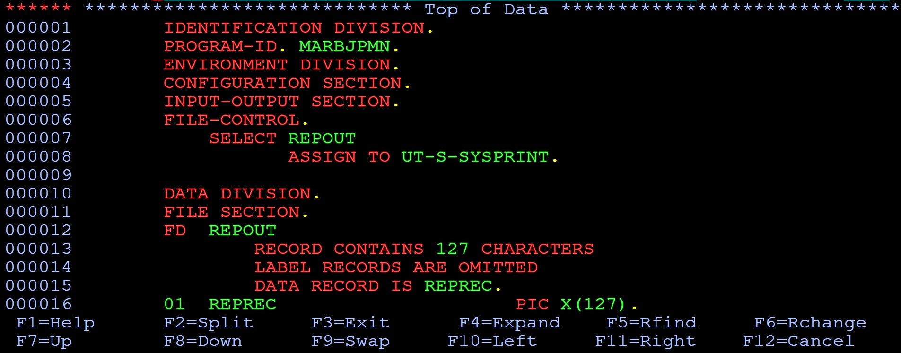
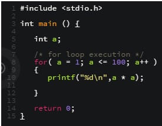
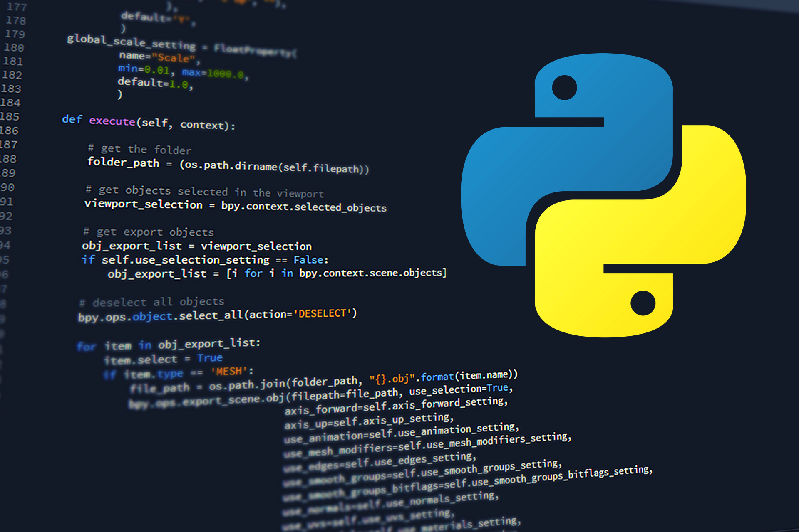
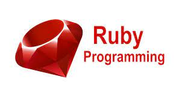
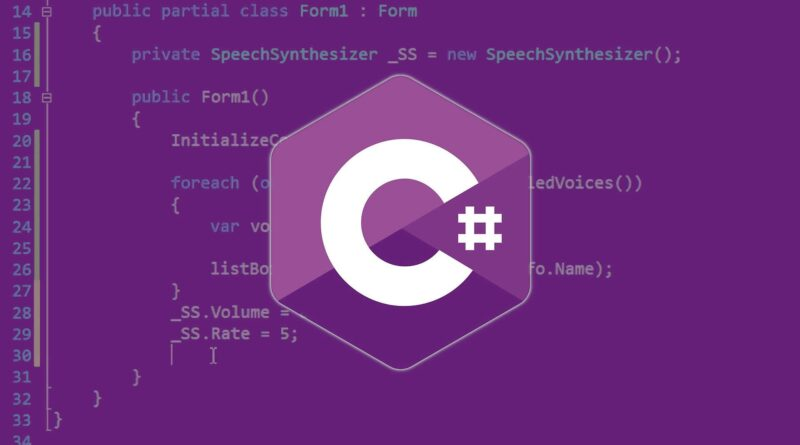
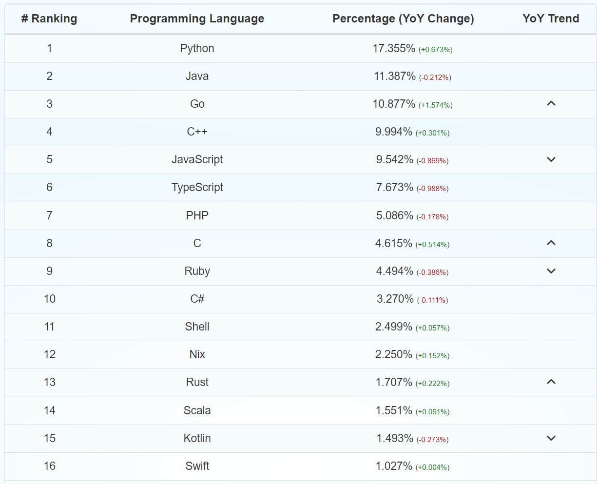
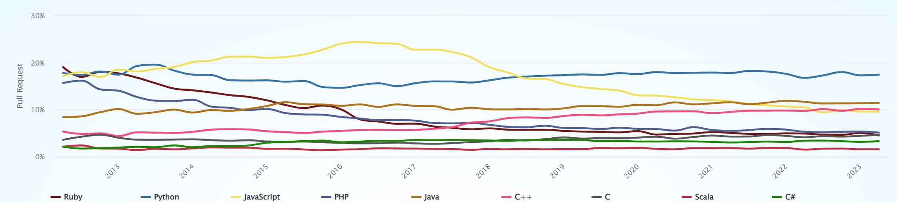

# Programming-course-cpp

`Jakub Piskorowski on 18/08/2023 wersja: 1.0`

## Temat: Historia języków programowania

Przedstawienie ewolucji języków programowania. 

&#x1F4D2; Poziom 1

Powrót do [Teoria programowania](1-programowanie-strukturalne/1-0-teoria/README.md)

## Objaśnienie

Witajcie! Dziś chciałbym porozmawiać o czymś, co może wydawać się odległe od nowoczesnych technologii, ale ma ogromne znaczenie dla naszego zrozumienia dzisiejszego świata informatyki. Chodzi o historię języków programowania. Może się wydawać, że poznanie, jakie języki programowania były używane dziesiątki lat temu, nie ma większego znaczenia w erze zaawansowanych algorytmów i sztucznej inteligencji. Jednakże, zrozumienie historii języków programowania jest jak odkrywanie korzeni drzewa, którego gałęzie wznoszą się ku niebu dzisiejszych innowacji.

Dlaczego warto poświęcić chwilę, by cofnąć się w czasie i spojrzeć na te pierwotne języki programowania? To właśnie w tych początkach ukryta jest kopalnia lekcji, które pomagają nam unikać błędów przeszłości, wybierać odpowiednie narzędzia do konkretnych zadań oraz budować solidny fundament dla przyszłych innowacji. Odkrywając, jak programiści radzili sobie w czasach, gdy komputery zajmowały całe pomieszczenia, możemy dostrzec, jak technologia odgrywała kluczową rolę w kształtowaniu świata, w którym żyjemy.

### Początki programowania

Na przestrzeni lat, w odpowiedzi na rozwój technologii tworzono języki coraz lepiej odpowiadające konkretnym potrzebom lub bardziej efektywne (ze względu na szybkość pisania w danym języku lub efektywność obliczeniową). Do dnia dzisiejszego powstało ich ponad dwa i pół tysiąca. Przedstawimy Wam jednak tylko te najpopularniejsze (według TIOBE – indeksu popularności języków, opierającym się liczbie wyszukiwani dla zapytań zawierających nazwę języka) oraz te, które znacząco wpłynęły na cały rozwój programowania i to, że dziś możemy korzystać z różnego rodzaju technologicznych nowinek.

**Taśmy perforowane**  
Zanim przejdziemy do właściwych programów komputerowych, trzeba wspomnieć o ich pierwowzorze, za jaki uznaje się **taśmy perforowane**. Odpowiednie dziurkowanie dawało możliwość zapisu, a następnie przetwarzania danych za pomocą maszyny. Za ich wynalazcę uważa się Josepha Jacquarda, a początkowo służyły do uzyskania tkaniny o powtarzalnym wzorze tkanej na krośnie. Dopiero Herman Hollerith na ich podstawie stworzył wzór karty na której zaczęto przechowywać dane.

**Fortran**  
Pierwszym językiem programowania jest Fortran, stworzony w latach 1954 – 1957 przez pracownika IBM, Johna Backusa i jego zespół. Pełna nazwa języka to Formula Translation, a początkowo służył on do przeprowadzania obliczeń statystycznych i matematycznych. To pierwszy język wysokiego poziomu (w którym kod i składnia są bardzo przystępne dla człowieka, a „niezrozumiałe” dla komputera, który potrzebuje dłuższego i bardziej skomplikowanego procesu kompilacji, aby wykonać program. Języki wysokiego poziomu charakteryzują się wysokim poziomem abstrakcji). Co ciekawe, Fortran jest wciąż używany.

**COBOL**  
Common Business Oriented Language powstał w 1959 roku w zespole prowadzonym przez Grace Murray Hopper dla systemów bankowych i przeprowadzanych przez nie transakcji. Co ciekawe, prace nad nim zostały zainicjowane przez amerykański Departament Obrony w celu ustalenia wspólnego języka programowania dla środowisk przemysłowych. Pod koniec XX wieku aż 90 proc. transakcji finansowych na całym świecie było przetwarzanych przez programy napisane w COBOLU.

**BASIC**  
Nazwa języka jest akronimem od Beginner's All-purpose Symbolic Instruction Code. Został stworzony w 1964 roku przez John Kemeny’ego i Thomas Kurtza z Dartmouth College, w oparciu m.in. o Fortran. Celem jego twórców było stworzenie języka łatwego w użytkowaniu, o wszechstronnym zastosowaniu. Dzięki temu programować mogły także osoby bez mocnej podbudowy technicznej i matematycznej. Ciekawostką jest, że Microsoft powstał po to, aby wydać i sprzedawać własny interpreter języka Visual BASIC, czyli unowocześnionej wersji BASIC-a.

**C / C++**  
Język C powstał w 1969 roku i jest dziś najpopularniejszym językiem programowania. Jego twórcą jest Dennis Ritchie. C spowodował rewolucję w świecie technologii – napisano w nim takie systemy operacyjne jak Linux, czy OS X. Od niego też pochodzi większość znanych dziś języków programowania. To prosty w konstrukcji i praktyczny w użyciu język, który zyskał sławę dzięki nieograniczonej możliwości przenoszenia na różne urządzenia. C wykorzystuje się głównie do programowania systemowego, sterowników urządzeń i innych niskopoziomowych części oprogramowania (pośredniczą między urządzeniami podłączonymi do komputera, a systemem operacyjnym).

Z czasem C ewoluował w C++ (stworzony w 1983 roku), nazwany nawet językiem programowania lat 90. Jest łatwiejszy w użyciu niż jego pierwowzór, a po niewielkich modyfikacjach umożliwia przenoszenie kodu źródłowego napisanego pierwotnie m.in. w Fortranie. Z tego rozwiązania korzystają ośrodki naukowe zajmujące się fizyką, m.in. słynny, szwajcarski CERN. C++, podobnie jak klasyczny C znajduje się na szczycie listy najpopularniejszych języków programowania i używany jest m.in przez Microsoft Office, Adobe PDF Reader oraz przeglądarkę Mozilla Firefox.

**Python**  
Język, który dla odmiany powstał w Holandii, a nie w USA, jest dziełem Guido van Rossuma. Wydany w wersji 1.0 w 1994 roku, jest rozwijany jako projekt Open Source , którym zarządza organizacja non-profit Python Software Foundation. Oznacza, że każdy może go modyfikować i ulepszać. Ciekawostką jest nazwa tego języka. Van Rossum chciał czegoś krótkiego i unikalnego, a przy okazji był fanem popularnego w latach siedemdziesiątych serialu komediowego „Latający Cyrk Monty Pythona”. W ten właśnie sposób nowy język stał się Pythonem. Jest uważany za język stosunkowo łatwy do nauczenia się, a w ostatnim czasie zdobywa coraz więcej zwolenników. W Pythonie powstał m.in. serwis YouTube.

**Ruby**  
Kto z Was korzysta z Basecampa do zarządzania swoimi projektami? To jedna ze znanych aplikacji, które powstały w języku Ruby. Narodził się on w wyniku poszukiwań Japończyka, Yukihiro Matsumoto, idealnego języka skryptowego. W związku z tym, że żaden z dostępnych nie spełniał oczekiwań, wybrał m.in. z Pythona, Perla i Smalltalka to co najlepsze, dołożył to czego mu w nich brakowało i tak, w 1993 roku narodził się Ruby. Z początku język nie wychodził poza granice kraju jego twórcy.. Boom na Ruby zaczął się na przełomie 2004 i 2005 roku, kiedy to zespół programistów kierowany przez Davida Heinemeiera Hanssona stworzył framework Ruby on Rails do tworzenia aplikacji webowych. Od tej pory Ruby pnie się w górę w zestawieniu najpopularniejszych języków programowania.

**PHP**  
Historia PHP (Personal Home Page) zaczyna się w 1995 roku, kiedy to autor nowego języka, Rasmus Lerdorf, upublicznił kod źródłowy. PHP powstał do tworzenia stron internetowych i projektowania aplikacji webowych. Od czasu pierwszej publikacji, PHP był wielokrotnie, przez zespoły różnych programistów udoskonalany i wydawany w nowych wersjach. Aktualnie trwają prace nad siódmą wersją tego języka. Dziś PHP jest jednym z dominujących języków programowania i obejmuje około 75% domen internetowych. Tworzy się w nim m.in. systemy zarządzania treścią, systemy forów dyskusyjnych czy aplikacje pocztowe. W języku PHP napisany został m.in. Facebook (który stworzył do niego Hip Hop PHP, tłumaczący kod źródłowy języka PHP na C++ w celu zmniejszenia obciążenia serwerów na których działa serwis).

**C#**  
Na zakończenie jeden z najmłodszych języków - C#. Odwołujący się bezpośrednio do języka C, język C# został stworzony prze firmę Microsoft w 2000 roku pod okiem Andersa Hejlsberga. W jego składni znajdują się także odwołania do C++ oraz Javy. Uważa się go za język prosty do nauczenia, m.in. ze względu na dużą ilość gotowych rozwiązań, które ułatwiają i skracają czas pisania. C# jest językiem ogólnego przeznaczenia, ściśle związanym z platformą programistyczną .NET Framework.

Źródło: [antyweb.pl](https://antyweb.pl/hello-world-czyli-krotka-historia-jezykow-programowania)

### Najpopularniejsze języki 2023 

Ranking według największej ilości "Pull request" w serwisie **GitHub** w 2 kwartale 2023.

Ranking popularności według lat w serwisie **GitHub**.

Źródło: [madnight.github.io](https://madnight.github.io/githut/#/pull_requests/2023/2)

---

### Zadania

1. **Analiza wpływu języka programowania na rozwój informatyki.**

Twoim zadaniem jest wybranie konkretnego języka programowania i przeprowadzenie analizy jego wpływu na rozwój dziedziny informatyki oraz na tworzenie oprogramowania.

Kroki do wykonania:

- **Wybór Języka:** Wybierz jeden język programowania, który miał znaczący wpływ na rozwój informatyki. Może to być język, który zapoczątkował nowe paradygmaty, był innowacyjny lub bardzo popularny w pewnym okresie.
- **Historia Języka:** Przedstaw krótką historię tego języka, w tym jego powstanie, główne cele oraz kontekst czasowy, w jakim się rozwijał.
- **Zastosowania i Projekty:** Przeanalizuj, w jakich dziedzinach informatyki i projektach ten język programowania był szczególnie użyteczny.
- **Podsumowanie:** Podsumuj, w jaki sposób wybrany język programowania odegrał kluczową rolę w rozwoju informatyki i w jakim stopniu jego wpływ jest wciąż odczuwalny.

