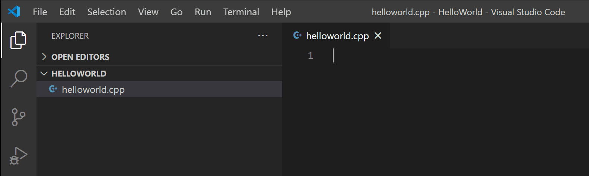
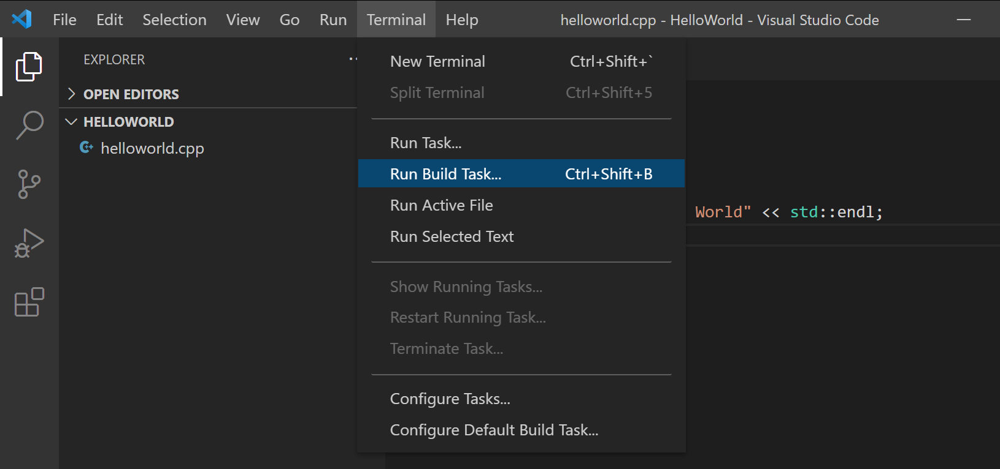

# Programming-course-cpp

`Jakub Piskorowski on 29/12/2021`

## Przygotowanie środowiska do pracy

1. [Visual Studio Code ](#1-visual-studio-code)  \
    1.1. [Instalacja rozszerzenia](#11-instalacja-rozszerzenia) \
    1.2. [Instalacja kompilatora](#12-instalacja-kompilatora) \
    1.3. [Instalacja MinGW-x64](#13-instalacja-mingw-x64) \
    1.4. [Dodanie ścieżki do kompilatora MinGW](#14-dodanie-sciezki-do-kompilatora-mingw) \
    1.5. [Sprawdzenie instalacji MinGW](#15-sprawdzenie-instalacji-mingw) \
    1.6. [Stworzenie nowego projektu i uruchomienie go](#16-stworzenie-nowego-projektu-i-uruchomienie-go) \
    1.7. [Dodanie kodu źródłowego](#17-dodanie-kodu-zrodlowego) \
    1.8. [Zbudowanie programu helloworld](#18-zbudowanie-programu-helloworld) \
    1.9. [Odpalenie programu helloworld](#19-odpalenie-programu-helloworld)
2. [Visual Studio Community](#2-visual-studio-community) \
    2.1. [Sprawdzenie wymagań systemowych](#21-sprawdzenie-wymagan-systemowych) \
    2.2. [Pobranie i instalacja visual Studio](#22-pobranie-i-instalacja-visual-studio) \
    2.3. [Instalacja rozszerzeń](#23-instalacja-rozszerzen) \
    2.4. [Odpalenie aplikacji konsolowej w C++](#24-odpalenie-aplikacji-konsolowej-w-cpp)

Powrót do głównego [folderu](../../README.md)

---
## 1. Visual Studio Code 

### 1.1 Instalacja rozszerzenia

1. Otwórz VS Code.
1. Wybierz rozszerzenia (ang. Extensions) po lewej stronie na pasku aktywności.
1. Wyszukaj `'C++'`.
1. Wybierz **Zainstaluj**.


### 1.2 Instalacja kompilatora
C++ jest językiem kompilowalnym, co oznacza, że kod źródłowy programu musi zostać przetłumaczony (skompilowany) przed uruchomieniem go. VS Code jest przede wszystkim edytorem i opiera się na narzędziach wiersza poleceń, które wykonują większość pracy programistycznej. Rozszerzenie C/C++ nie obejmuje kompilatora ani debugera C++. Będziesz musiał zainstalować te narzędzia lub użyć tych, które są już zainstalowane na twoim komputerze.

Niektóre platformy, takie jak Linux lub macOS, mają już zainstalowany kompilator C++. Większość dystrybucji Linuksa ma zainstalowaną kolekcję GNU Compiler Collection (GCC), a użytkownicy macOS mogą uzyskać narzędzia Clang z Xcode.

### 1.3 Instalacja MinGW-x64

Zainstalujemy Mingw-w64 za pośrednictwem [MSYS2](https://www.msys2.org/), który zapewnia aktualne, natywne kompilacje GCC, Mingw-w64 i inne przydatne narzędzia i biblioteki C++. [Kliknij tutaj](https://github.com/msys2/msys2-installer/releases/download/2021-06-04/msys2-x86_64-20210604.exe), aby pobrać instalator MSYS2. Następnie postępuj zgodnie z instrukcjami na stronie [MSYS2](https://www.msys2.org/), aby zainstalować Mingw-w64.

### 1.4 Dodanie sciezki do kompilatora MinGW

Dodanie zmiennej środowiskowej `PATH` w systemie Windows do folderu `bin` Mingw-w64.

   1. Wejdź w ustawienia systemu Windows.
   1. Wyszukkaj **Edycja zmiennych środowiskowych**.
   1. Wybierz `Path`, następnie kliknij **Edytuj**.
   1. Wybierz **Nowy** następnie dodaj ścieżkę do folderu Mingw-w64 , z dołączeniem do ścieżki systemowej `\mingw64\bin`. Dokładna ścieżka zależy od wersji Mingw-w64, którą zainstalowałeś i gdzie ją zainstalowałeś.
   1. Kliknij **OK** aby zapisać i zaktualizować PATH. Będziesz musiał ponownie otworzyć wszystkie okna konsoli, aby nowa lokalizacja PATH była dostępna.

### 1.5 Sprawdzenie instalacji MinGW

Aby sprawdzić, czy narzędzia Mingw-w64 są prawidłowo zainstalowane i dostępne, otwórz **nowy** wiersz poleceń i wpisz:

```bash
g++ --version
```

Jeśli nie widzisz oczekiwanego wyniku lub `g++` lub nie jest rozpoznawanym poleceniem, upewnij się, że wpis PATH odpowiada lokalizacji Mingw-w64, w której znajdują się narzędzia kompilatora.

### 1.6 Stworzenie nowego projektu i uruchomienie go

Aby upewnić się, że kompilator jest poprawnie zainstalowany i skonfigurowany, stworzymy najprostszy program Hello World C++.

Utwórz folder o nazwie "HelloWorld" i otwórz VS Code w tym folderze (komenda (cmd) `code .` otwiera VS Code w bieżącym folderze):

Teraz utwórz nowy plik o nazwie `helloworld.cpp` za pomocą przycisku **Nowy plik** w eksploratorze plików lub polecenia **Plik** > **Nowy plik**”.




### 1.7 Dodanie kodu zrodlowego

Teraz wklej ten kod źródłowy:

```cpp
#include <iostream>
using namespace std;

int main()
{
    cout << "Hello World" << endl;
}
```

Następnie zapisz program `Ctrl + S`.

### 1.8 Zbudowanie programu helloworld

Teraz, gdy mamy już prosty program w C++, zbudujmy go. Wybierz polecenie **Terminal** > **Uruchom zadanie kompilacji** z menu głównego.



Spowoduje to wyświetlenie listy rozwijanej z różnymi opcjami zadań kompilatora. Jeśli używasz zestawu narzędzi GCC, takiego jak MinGW, wybierz **C/C++: g++.exe build active file**.


Spowoduje to skompilowanie `helloworld.cpp` i utworzenie pliku wykonywalnego o nazwie `helloworld.exe`, który pojawi się w Eksploratorze plików.


### 1.9 Odpalenie programu helloworld

Z wiersza poleceń lub nowego zintegrowanego terminala VS Code możesz teraz uruchomić program, wpisując ".\helloworld".


Jeśli wszystko jest poprawnie skonfigurowane, powinieneś zobaczyć wynik "Hello World".

Źródło GitHub: [microsoft/vscode-docs](https://github.com/microsoft/vscode-docs/blob/main/docs/languages/cpp.md)

---

## 2. Visual Studio Community

### 2.1 Sprawdzenie wymagan systemowych

Przed rozpoczęciem instalacji programu Visual Studio:

1. Sprawdź [Wymagania systemowe](https://docs.microsoft.com/pl-pl/visualstudio/releases/2022/system-requirements#visual-studio-2022-system-requirements). Te wymagania pomagą dowiedzieć się, czy komputer obsługuje program Visual Studio 2022.

2. Zastosuj najnowsze aktualizacje systemu Windows. Te aktualizacje zapewniają, że komputer ma zarówno najnowsze aktualizacje zabezpieczeń, jak i wymagane składniki systemu dla programu Visual Studio.

3. Ponowne uruchomienie zapewnia, że wszelkie oczekujące instalacje lub aktualizacje nie utrudnią instalacji programu Visual Studio.

4. Zwolnij miejsce. Usuń niepotrzebne pliki i aplikacje, na przykład uruchamiając aplikację Oczyszczanie dysku.

W przypadku pytań dotyczących uruchamiania poprzednich wersji programu Visual Studio równolegle z programem Visual Studio 2022,
Zobacz stronę Visual Studio 2022 Platform Targeting and Compatibility.

### 2.2 Pobranie i instalacja visual Studio

Następnie pobierz program [Visual Studio Community](https://visualstudio.microsoft.com/pl/thank-you-downloading-visual-studio/?sku=Community&rel=17).

Uruchom pobrany plik instalacyjny, aby zainstalować program Visual Studio. Ten lekki instalator zawiera wszystko, czego potrzebujesz do zainstalowania i dostosowania programu Visual Studio.

### 2.3 Instalacja rozszerzen

Po zainstalowaniu instalatora można go użyć do dostosowania instalacji, wybierając odpowiednie rozszerzenie lub zestawy funkcji.

1. Znajdź odpowiednie rozszerzenie na ekranie **Instalowanie programu Visual Studio**.


Aby uzyskać podstawową obsługę języków C i C++, wybierz rozszerzenie **"Desktop development with C++"**. Jest wyposażony w domyślny edytor, który obejmuje podstawową obsługę edycji kodu.

Okienko **"Installation details"** zawiera listę dołączonych i opcjonalnych składników zainstalowanych przez każde rozszerzenie. Na tej liście można zaznaczyć lub odznaczyć opcjonalne komponenty.

2. Po wybraniu rozszerzenia i składników opcjonalnych, wybierz opcję **"Install"**.

Następnie pojawiają się ekrany stanu, który pokazuje postęp instalacji programu Visual Studio.

3. Zmień lokalizację instalacji (opcjonalne)

Możesz przenieść pamięć podręczną pobierania, rozszerzeń, zestawów SDK i narzędzia na różne dyski i zachować program Visual Studio na dysku, na którym jest on uruchamiany najszybciej.

### 2.4 Odpalenie aplikacji konsolowej w Cpp

1. Po zakończeniu instalacji programu Visual Studio. Uruchom program **Visual Studio 2020**.

2. W oknie startowym wybierz **Create new project**.

3. Na liście rozwijanej **All languages** wybierz **C++**.

4. Wybierz **Console App** a nastepnie **Next**.

5. W polu **Project name** wpisz nazwę projektu. W polu **Location** wybierz miejsce stworzenia projektu.

6. Aby uruchomic program kliknij w zieloną strzałkę **Local Windows Debugger**

Źródło GitHub: [MicrosoftDocs/cpp-docs](https://github.com/MicrosoftDocs/cpp-docs/blob/main/docs/build/vscpp-step-0-installation.md)
