# Programming-course-cpp

`Jakub Piskorowski on 14/02/2022`

## Wprowadzenie do git'a

0 [Skrót - podstawowe komendy](#0-skrot---podstawowe-komendy) \
1 [Stworzenie konta na GitHub](#1-stworzenie-konta-na-github) \
2 [Stworz nowe repozytorium](#2-stworz-nowe-repozytorium) \
3 [Instalacja git bash](#3-instalacja-git-bash) \
5 [Klonowanie repozytorium](#4-klonowanie-repozytorium) \
6 [Dodanie pliku](#5-dodanie-pliku)

Powrót do głównego [folderu](../../README.md)

---

## 0 Skrot - podstawowe komendy

```text
git pull
----------
git add *
git status
git commit -m "Komentarz"
git push origin main
```

## 1 Stworzenie konta na GitHub

Najłatwiejszym sposobem na rozpoczęcie jest utworzenie konta na [GitHub.com](https://github.com) (to nic nie kosztuje).


Wpisz nazwę użytkownika, wprowadź adres e-mail i hasło, a następnie kliknij **Zarejestruj się w GitHub**. Gdy już jesteś zalogowany, będzie to wyglądać mniej więcej tak:


## 2 Stworz nowe repozytorium

Repozytorium jest jak miejsce lub pojemnik, w którym coś jest przechowywane. W tym przypadku tworzymy repozytorium Git do przechowywania kodu. Aby utworzyć nowe repozytorium, wybierz **Nowe repozytorium (New repository)** z menu rozwijanego znaku `+` (widać, że zostało wybrane w prawym górnym rogu na powyższym obrazku).

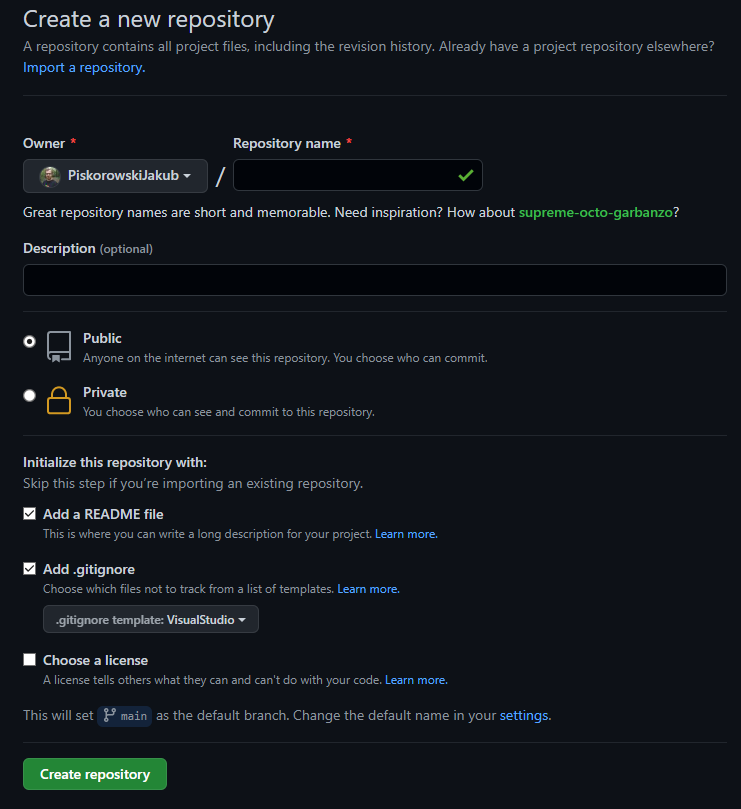

Wpisz nazwę swojego repozytorium **(Repository name)**, \
dodajemy plik **README (Add a README file)**, \
oraz plik **.gitignore (Add .gitignore)** oraz wybieramy język lub środowisko w tórym będziemy pisać np. **VisualStudio**, \
kliknij **Utwórz repozytorium (Create repository)**.

Gratulacje! Skonfigurowałeś swoje pierwsze repozytorium na GitHub.com.

## 3 Instalacja git bash

Pobieramy program instalacyjny z strony [git-scm.com](https://git-scm.com/downloads) i wybieramy na jaki system operacyjny chcemy zainstalować gita.

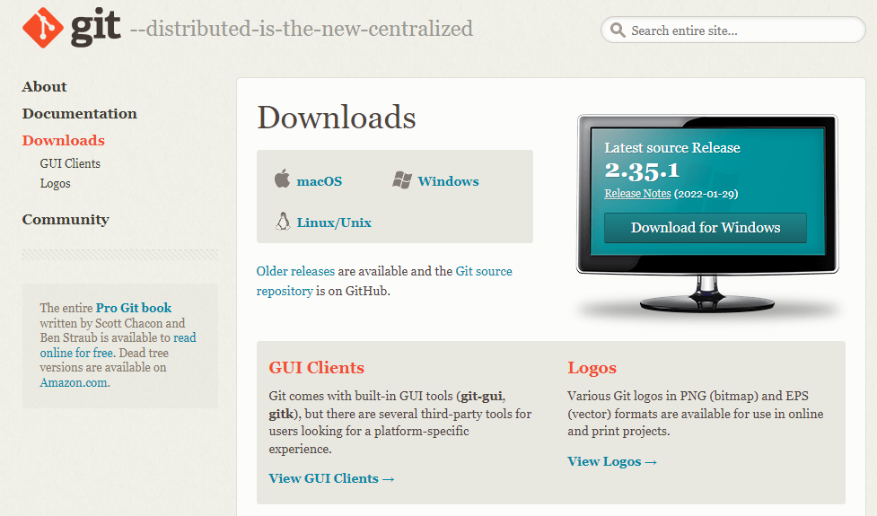

Nastepnie wybieramy wersję x32 lub 64.

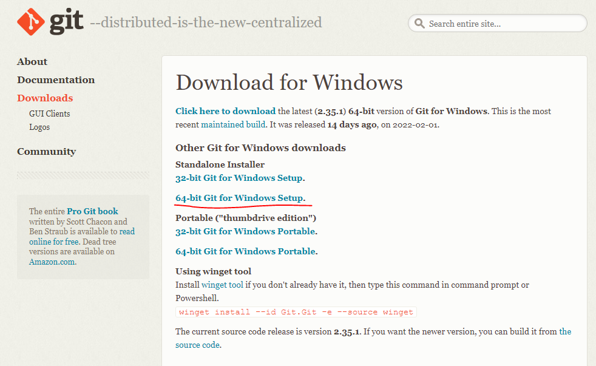

Następnie w procesie instalacji nie wprawadzamy zmian, zostawiamy wszystkie opcje rekomendowane.

Po zakończonej instalacji możemy włączyć **"git bash"**.

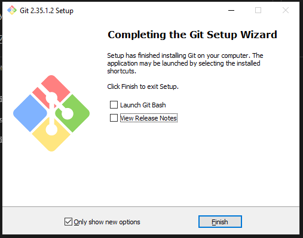

## 4 Klonowanie repozytorium

Następnie kliając w przycisk **Code**, pozostając w zakładce **HTTPS** kopiujemy link do repozytorium.

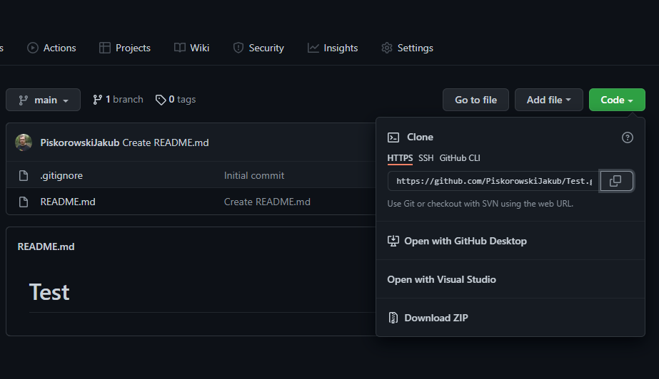

Otwieramy terminal **Git Bash** a następnie poleceniem `cd` przechodzimy do katalogu, w którym chcemy zapisać projekt lub w menadrzeże plików jak wejdziemy do danego folderu to klikamy prawym przyciskiem myszy i wybieramy opcję **Git Bash here**:


Wykorzystując polecenie ``git clone`` klonujemy nasze repozytorium na nasz lokalny folder:

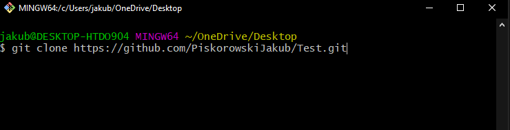

Po prawidłowym sklonowaniu repozytorium otrzymamy następujący komunikat:

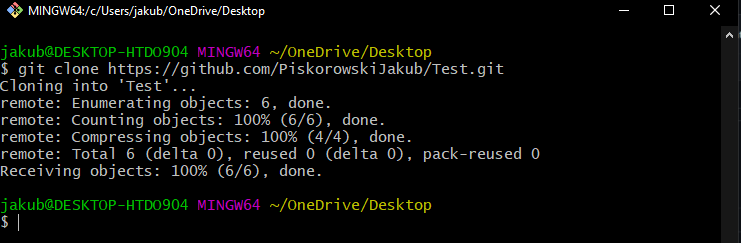

Wchodzimy do slonowanego repozytorium poleceniem `cd <nazwa>`. W tym momencie obok ścieżki pojawi nam się nazwa gałęzi głównej **main** naszego repozytorium.

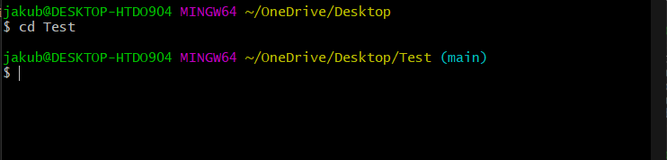

W eksloratorze plików otrzymamy **ukryty folder** ``.git`` w tórym znajdują się pliki konfiguracyjne do gita. Plik `.gitignore`, w którym zapisane są pliki ignorowane przez gita oraz `README.md`, przechowujący informacje do wyświetlenia o naszym projekcie.

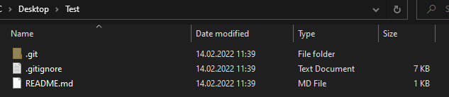

Teraz możesz tworzyć zawartość twojego repozytorium.

## 5 Dodanie pliku

Pierwszym plikiem, który zostanie wrzucony będzie plik `README.md`, który będzie zawierał opis tego co zawiera repozytorium.

Pod linkiem [README.md](img/README.md) został udostępniony szablon do wrzucenia na swoje lokalne repozytorium.

Pierwszym krokiem przed wrzuceniem zmian na GitHub-a. Jest zatualizowanie pliku `config` znajdujący się w ukrytym folderze `.git`. Podajemy swoją nazwę użytkownika i email. Poniżej został przedstawiony przykład dodania danych użytkownika do pliku konfiguracyjnego.

```text
[user]
    name = Jakub Piskorowski
    email = jakub@gmail.com
```

Po zaktualizowaniu pliu `README.md` możemy sprawdzić status określający, tóre pliki zostały zmodyfikowane. W terminalu wpisując polecenie `git status` otrzymamy listę plików, tóre zostaly zmodyfikowane.

```text
git status
```

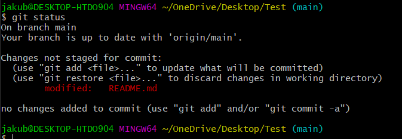

Poleceniem `git add` podamy pliki, które chcemy wrzucić na GitHub-a. Możemy podawać konkretne nazwy plików do wrzucenia lub wpisać znak gwiazdki `*` aby dodać wszystkie pliki na raz.

```text
git add *
```

Teraz po wpisaniu polecenia `git status` zobaczymy na zielono pliki, które zostaną dodane.

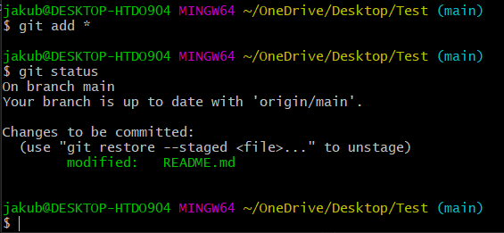

Następnie poleceniem `git commit` dodajemy komentarz do zastosowanych zmian. Piszemy krótko co zostało zmienione lub co zostało dodane w projekcie.

```text
git commit -m "Updated readme"
```

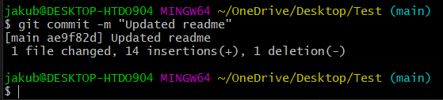

Na tym etapie możemy wrzucić zmiany na GitHuba poleceniem `git push origin main`. Zmiany zostaną wrzucone na nanszą główną gałąź rozwoju, która nazwya się `main`.

```text
git push origin main
```

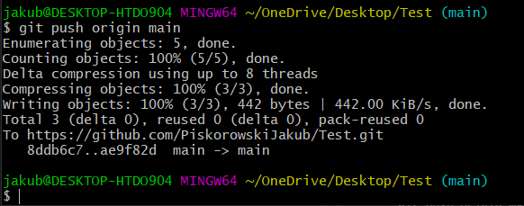

Aby pobrać zmiany z zdalnego repozytorium nalezy użyć polecenia `git pull`.

```text
git pull
```
