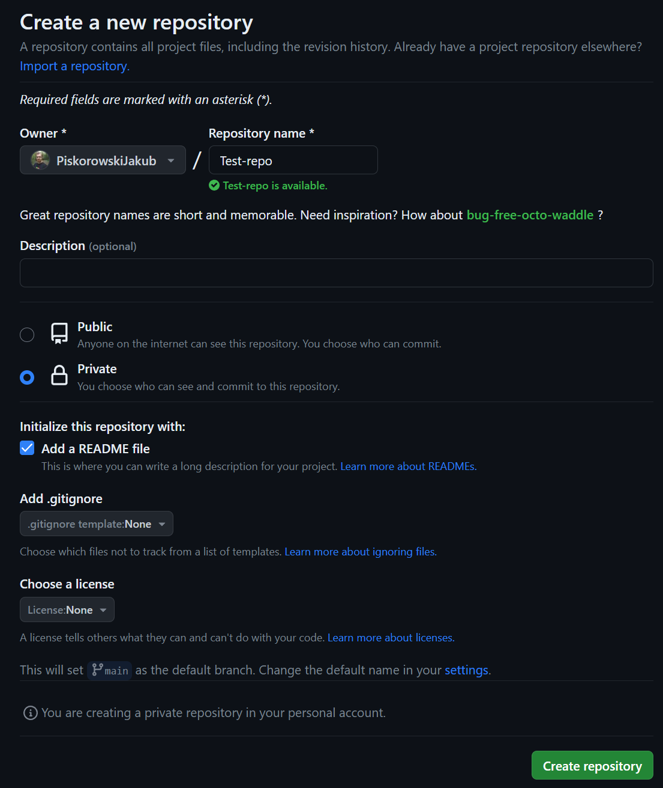
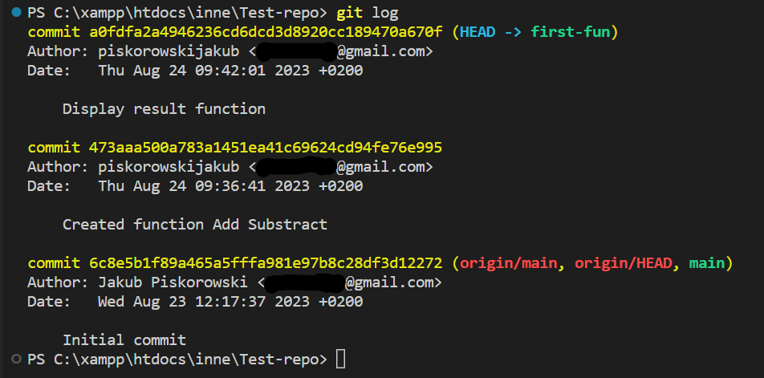
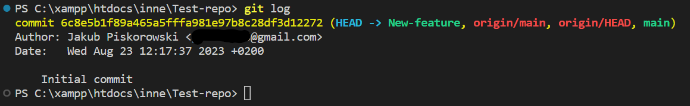
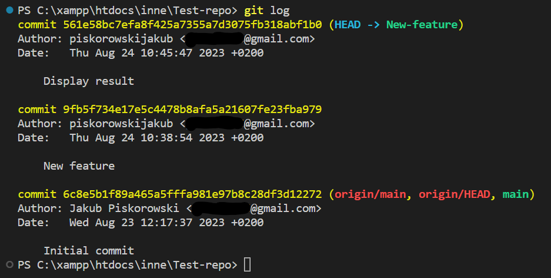
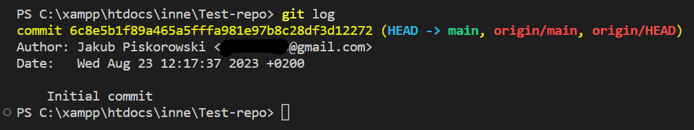

# Programming-course-cpp

`Jakub Piskorowski on 24/08/2023`

## Git Branch – Czym są gałęzie w systemi kontroli wersji?

Powrót do głównego [folderu](../../README.md)

---

## Skrot - podstawowe komendy

```bash
// Lista lokalnych gałęzi
git branch

// Stworzenie nowej gałęzi i przełączenie się na nią
git checkout -b <nazwa-brancha>

// Przełączenie się na gałąź main
git checkout main

// Wypchnięcie zmian w wszystkich gałęziach
git push origin --all

// Historia commitów w danej gałęzi 
git log
```

## Czym jest branch?

**Branch to nic innego jak gałąź** - czyli taka odnoga naszego projektu, utworzona w danym czasie. Coś takiego jak kopia - może żyć swoim życiem i w każdej chwili może być dołączona do głównej gałęzi.

W końcu miałeś już do czynienia w Gicie z jedną gałęzią - a tą gałęzią jest właśnie **master** czyli **główna gałąź repozytorium.**

**Branch** może zostać utworzony tak naprawdę na podstawie każdej z innych gałęzi, lecz zazwyczaj się to robi na podstawie głównej gałęzi – **master.**

## Po co te całe gałęzie?

Gałezię pozwalają w bardzo w prosty sposób pracować wielu osobom jednocześnie nad danym projektem. Przypuśćmy, że mamy duży projekt, szykuje się nowa wersja produktu - około 12 feature’ów, 5 programistów.

Dzięki branchom wszyscy programiści mogą pracować równolegle nie wchodząc sobie wcale w paradę - jak by to wyglądało?

Każdy programista na początek wziąłby jedno zadanie - jedna dodatkowa funkcjonalność i dla niej utworzyłem osobny branch odłączając się od gałęzi master. Po ukończeniu swojego zadania mógłby dołączyć swój branch do mastera i pracować nad kolejnym - łączenie gałęzi zostanie opisane w kolejnym temacie. Teraz skupmy się na branchach.

## Wykorzystywane komendy

Sprawdzenie dostępnych gałęzi w repozytorium:
``` bash
git branch
```
Utworzenie nowego brancha:
``` bash 
git branch <nazwa-brancha>
```
Przełączenie się na gałąź:
``` bash
git checkout <nazwa-brancha>
```
Przełączenie się na gałąź i utworzenie jeśli jeszcze nie istniała:
``` bash
git checkout -b <nazwa-brancha>
```
Przyda nam się jeszcze jedna - do sprawdzenia historii commitów danego brancha:
``` bash
git log
```

Źródło: [1024kb.pl](https://1024kb.pl/kjop/tydzien-7/git-branch-czym-sa-galezie-systemi-kontroli-wersji/)


## Stworzenie projektu

Stwórzmy sobie nowe zdalne repozytorium, na którym sobie przetestujemy nowe polecenia.  



Następnie należy sklonować do nas lokalnie nasze zdalne, nowe repozytorium.
``` bash
git clone https://github.com/PiskorowskiJakub/Test-repo.git
```

### Stworzenie pierwszej funkcjonalności na nowej gałęzi

Pierwszym naszym zadaniem jest stworzenie dwóch funkcji. 

Na początku wylistujmy sobie dostępne branche:
``` bash
git branch
```
I jak widać istnieje tylko main: 
``` bash
* main
```
Stwórzmy, więc nasz pierwszy branch - `first-fun`:
``` bash
git branch first-fun
```
I tym razem po wylistowaniu otrzymamy trochę dłuższą listę:
``` bash
  first-fun
* main
```
Widzisz, że gwiazdka jest tylko przy main - **oznacza to, że aktualnie jesteśmy na gałęzi main!**

Zmieńmy, więc branch na **first-fun**.
``` bash
git checkout first-fun
```
I powinniśmy otrzymać:
``` bash
Switched to branch 'first-fun'
```

Teraz możemy rozpocząc prace nad naszymi funkcjami. Oby dwie funkcje będą przyjmować **dwa parametry wejściowe.** Jedna **funkcja** będzie **dodawała dwie wartości** do siebie a druga **odejmowała.** Cały kod został napisany w głównym pliku `index.php`.

```php
function Add($x, $y){
    return $x + $y;
}

function Subtract($x, $y){
    return $x - $y;
}
```
Zakomitujmy zmiany:
```bash
git add *
git commit -m "Created function Add Substract"
```

Dodajmy teraz wyświetlenie wyniku działania naszych funkcji:
```php
$a = 2;
$b = 2;

echo $a , " + " , $b , " = " , Add($a, $b);
echo "<br>";
echo $a , " - " , $b , " = " , Subtract($a, $b);
```
I ponownie zacommitujmy zmiany na naszej gałęzi:
```bash
git add *
git commit -m "Display result function"
```
I teraz możemy wyświetlić sobie całą historię zmian na naszej gałęzi:



### Nowa gałąź

Kolejnym naszym zadaniem jest stworzenie nowych funkcjonalności w nowych funkcjach. 

W takim razie wracamy do gałęzi głównej, ponieważ od niej będziemy tworzyć nową gałąź.
```bash
git checkout main
```
Oraz tworzymy nową gałąź `New-feature`. Tym razem użyliśmy komendy checkout z parametrem **-b**, aby utworzyć branch i automatycznie przejść do niego.
```bash
git checkout -b New-feature
```
I jak widać automatycznie zostaliśmy przeniesieni do nowego brancha:
```bash
Switched to a new branch 'New-feature'
```
I mam teraz takie branche:
```bash
* New-feature
  first-fun
  main
```
A nasza historia commitów wygląda aktualnie tak: (**git log**)



Dlaczego tak? Ponieważ utworzyliśmy gałąź od głównej gałęzi, gdzie był wykonany tylko init commit - zmiany na branchu first-fun w ogóle nas nie dotyczą, dopóki ich nie dołączymy do głównej gałęzi.

W takim razie stwórzmy sobie nowy plik (`feature.php`), który będzie zawierał nasze nowe funkcje.
```php
function Multiplication($x, $y){
    return $x * $y;
}

function Division($x, $y){
    return $x / $y;
}
```
Zacommitujmy oczywiście zmiany:
```bash
git add feature.php
git commit -m "New feature"
```

I teraz stwórzmy na nowo plik `index.php`, w którym dołączymy nasz nowy plik i wyświetlimy wynik działania naszych nowych funkcji. 
```php
include 'feature.php';

$a = 4;
$b = 2;

echo $a , " * " , $b , " = " , Multiplication($a, $b);
echo "<br>";
echo $a , " / " , $b , " = " , Division($a, $b);
```
I oczywiście zacommitujmy naszą zmianę:
```bash
git add index.php
git commit -m "Display result"
```
I zróbmy teraz git log:



I jak widać nasze zmiany są widoczne na naszym branchu w historii commitów.

### Na koniec

Na koniec wróćmy, więc do głównej gałęzi:
```bash
git checkout main
```
Oraz sprawdźmy ponownie historię maina:
```bash
git log
```
I otrzymamy:



I jak widać żadna zmiana na branchu nie wywołała zmian na mainie - czyli praca równoległa wielu programistów jest możliwa.

Jednak co teraz z tymi gałęziami?

Trzeba będzie je dołączyć do głównej gałęzi - jednak tym zajmiemy się już w następnym temacie!

Aby wypchnąć wszystkie swoje branche na zdalne repozytorium musisz użyć komendy:
```bash
git push origin --all
```
Dzięki temu zostaną wysłane wszystkie dostępne branche.
