# Programming-course-cpp

`Jakub Piskorowski on 25/08/2023`

## Pull request i git merge

Powrót do głównego [folderu](../../README.md)

---

## Skrot - podstawowe komendy

```bash
// Pobranie zmian z zdalnego repozytorium
git pull origin main

// Przełączenie się na główną gałąź
git checkout main

// Połączenie nowej gałęzi z główną
git merge first-fun

// Po wystąpieniu i naprawieniu konfliktów
git add *
git commit -m "Resolve merge conflicts"
git push origin first-fun
git checkout main
git merge first-fun

// Wypchniecie zmian na zdalne repozytorium
git push origin main


```

## Przygotowanie pull request - GitHub

Czas przenieść się do GitHub’a. Wchodzimy na górze w zakładkę "**Pull request**" oraz klikamy zielony przycisk "**New pull request**".

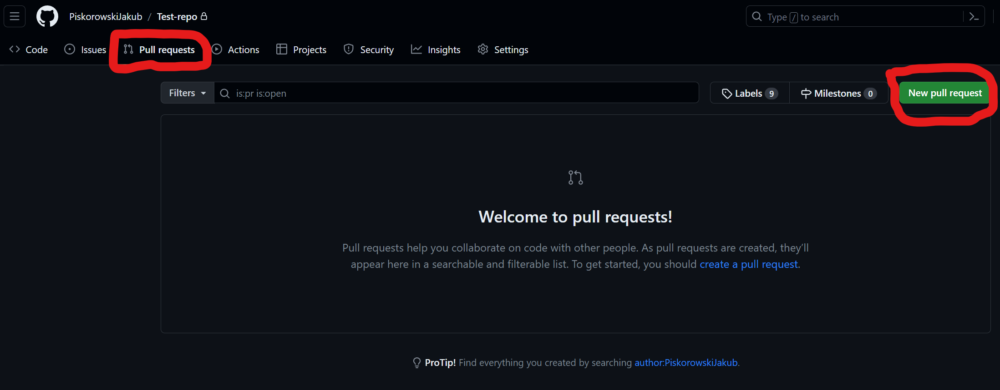

Następnie możemy wybrać, którą branch chcemy połączyć z naszą główną gałęzią `main`. W naszym przypadku wybieramy gałąź `first-fun`. Od razu pokazało nam zielony komunikat "**Able to marge**", czyli że bez problemu będziemy mogli później połączyć gałęzie. Teraz klikamy zielony przycisk **Create pull request**.

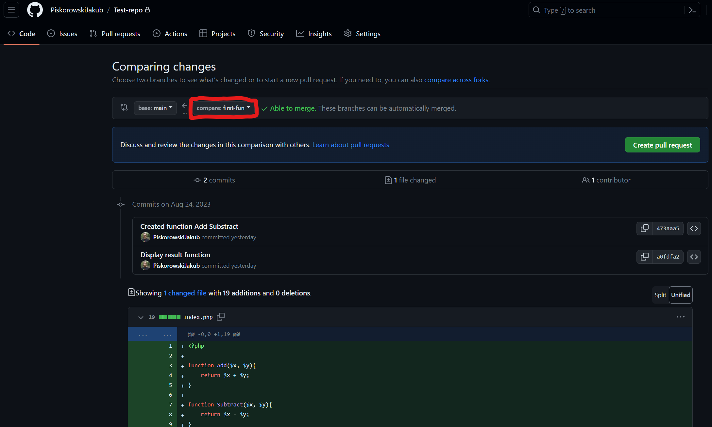

Teraz możemy utworzyć nasz pierwszy pull request. Na samej górze mamy **tutuł** naszego requesta a poniżej dokładny opis tego co się zmieniło w projekcie, opis naszej funkcjonalności. Możemy tam używać znaczników do **pliku Readme**. Po prawej mamy dodatkowe ustawienia naszego pull requesta. Jeżeli już napisaliśmy opis naszej funkcjonalności to możemy nacisnąć zielony przycisk `Create pull request`.

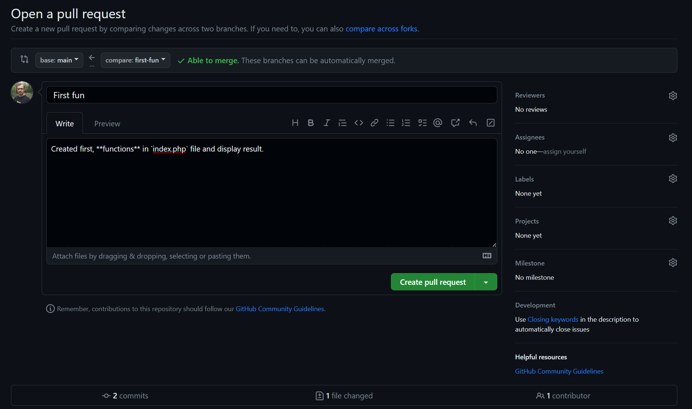

Mamy pierwszy otworzony **Pull request** na górze mamy kilka zakładek aby sprawdzić co się zmieniło. W zakładce **Commits** możemy zobaczyć jakie commity zostały stworzone na danej gałęzi. W ostatniej zakładce **Files changed** sprawdzimy jakie pliki zostały zmodyfikowane lub stworzone. Na samym dole możemy wstawić jakiś **komentarz do danego pull requesta** jeżeli mamy jakieś uwagi do zmian.  

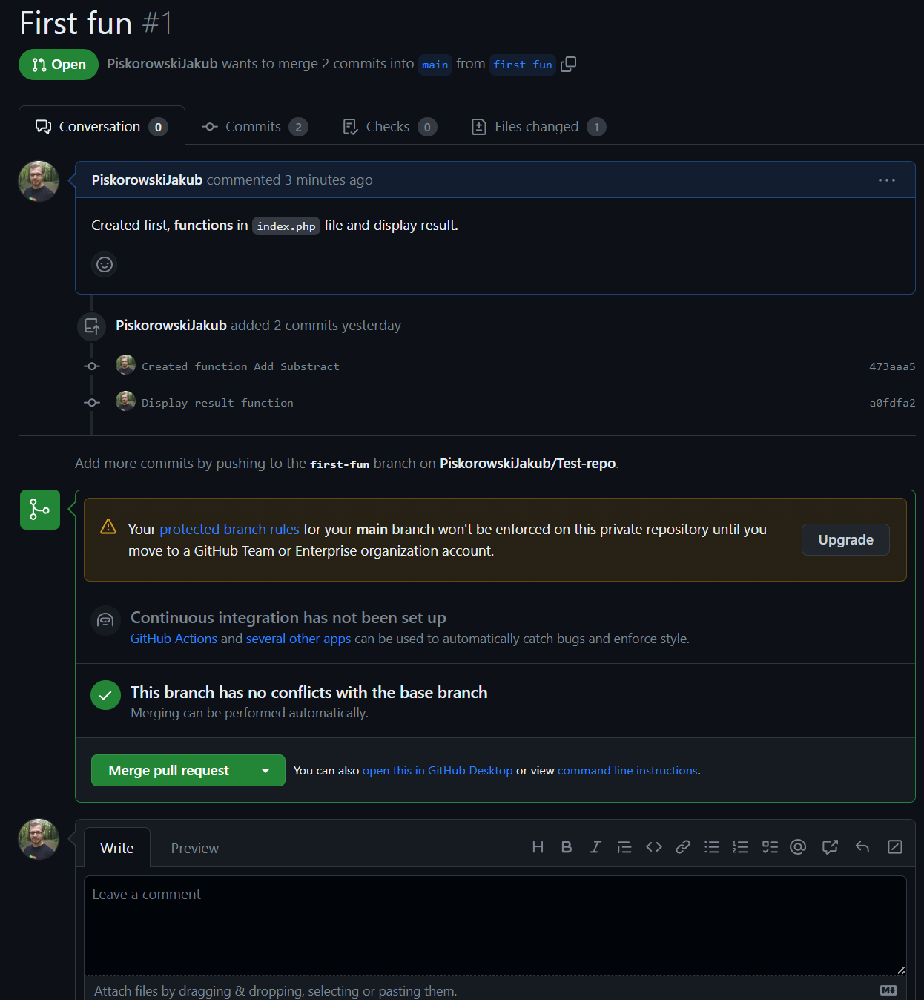

Jeżeli nie mamy zastrzeżeń do zmian jakie zaszły na nowej gałęzi i bez konfliktów możemy je połączyć z główną gałęzią to możemy to zrobić na dwa sposoby. Pierwszy, najprostrzy, to kliknąć zielony przycisk "**Merge pull request**" lub zrobić to przez wiersz poleceń. 

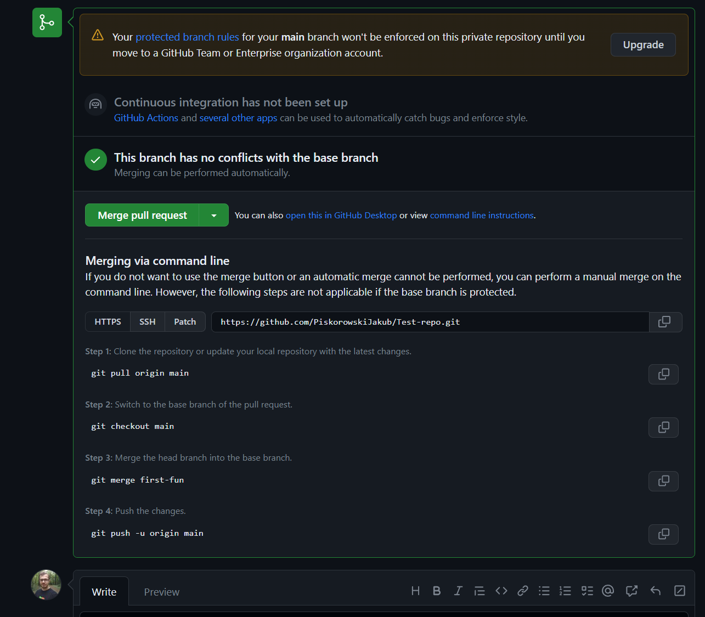

### Łączenie gałęzi poprzez wiersz poleceń

Musimy najpierw zaktualizować swoje lokalne repozytorium aby posiadać aktualną wersję z tym co jest na zdalnym repozytorium.
```bash
git pull origin main
```
Teraz możemy się przełączyć na  **główną branch** z naszego ***pull request**.
```bash
git checkout main
``` 
Kolejnyk krokiem jest zrobienie "**marge**", czyli połączenie nowej gałęzi z naszą główną.
```bash
git merge first-fun
```
Jeżeli wszystko przeszło bez konfliktów, możemy "**push**" nasze zmiany na zdalne repozytorium.
```bash
git push origin main
```

Teraz po poprawnym **marge** nasz **pull request** został automatycznie zamknięty. Możemy go teraz podejrzeć w zakładce **pull request** i **closed**. 

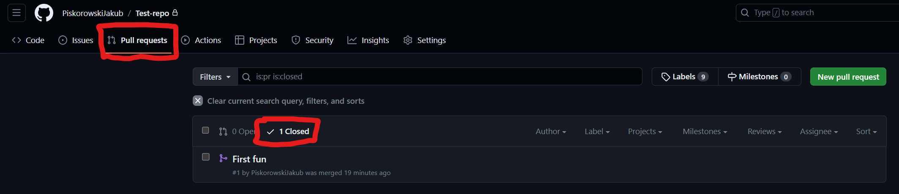

### Czym jest Merge?

Merge jest niczym innym jak scalaniem gałęzi projektu, nie musi to być tylko scalanie do gałęzi głównej - bez problemu możemy mergować gałęzie między sobą jak tylko nam się podoba.

### Konflikty

No, nie do końca. Istnieje jeszcze coś takiego jak konflikty...

Powiedziałem, że możemy mergować gałęzię projektu jak żywnie nam się to podoba, ale to nie jest do końca prawda. Podczas próby scalania gałęzi mogą wystąpić tak zwane **merge conflicts** - konflikty scalania.

Czym są konflikty scalania? Może lepiej będzie zapytać - kiedy one występują?

Występują one, gdy na łączonych branchach w tym samym miejscu w pliku są różne zmiany - już pokazuję na naszym testowym przykładzie.

Obecnie na zdalnym repozytorium, na gałęzi **main** plik `index.php` wygląda następująco:
```php
function Add($x, $y){
    return $x + $y;
}

function Subtract($x, $y){
    return $x - $y;
}

$a = 2;
$b = 2;

echo $a , " + " , $b , " = " , Add($a, $b);
echo "<br>";
echo $a , " - " , $b , " = " , Subtract($a, $b);
```

Jednak **programista 2** zmodyfikował ten plik (`index.php`) na branchu **New-feature** w ten sposób: 
```php
include 'feature.php';

$a = 4;
$b = 2;

echo $a , " * " , $b , " = " , Multiplication($a, $b);
echo "<br>";
echo $a , " / " , $b , " = " , Division($a, $b);
```

Jak widzisz mamy dwie wersje tego samego pliku, gdzie teraz mamy konflikt. 

### Konflikt

O ile Poprzedni programista bez problemu mógł scalić swoje zmiany z główną gałęzią, tak teraz **Programista 1** już nie będzie mógł tego zrobić. Dlaczego?

Ponieważ na branchu **main** plik ma inny stan, który nie jest równy ze stanem, który dołączył **new-feature** i w taki o to sposób wytwarzają się **merge conflicts.**

### Jak je rozwiązać?

Jest kilka sposobów rozwiązywania konfliktów - ja pokażę Ci chyba najprostszy - przy użyciu **git pull.**

Konflikty niestety musimy rozwiązywać ręcznie - przez rozwiązywanie mam na myśli wybranie ostatecznego rozwiązania, które ma zostać zapisane na masterze. Po tym wszystkim mamy już możliwość zmergować branch do mastera.

Nie martw się - dużo teorii, ale już przechodzimy do praktyki na podstawie naszego testowego projektu.

Źródło: [1024kb.pl](https://1024kb.pl/kjop/tydzien-7/git-merge-o-chodzi-tym-calem-scalaniem/)

### Git merge

Powyżej udało nam się stworzyć **pull request** i zrobić **git marge** bez żadnych konfliktów. Tym razem zacznijmy tak samo. Również stwórzmy **Pull request** dla naszej branchy `New-feature`. 

Jak przełaczymy się na naszą gałąź `New-feature` od razu dostajemy komunikat że mamy dwa commity do tyłu od momentu stworzenia tej gałęzi oraz mamy 2 commity nowe stworzone na tej gałęzi w przód.

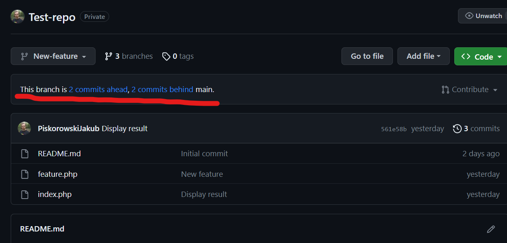

Przejdźmy jednak do zakładi **Pull request** i wybieżmy naszą gałąź `New-feature`, którą chcemy połączyć z gałęzią `main`. Od razu dostaniemy komunikat że nie możemy dokonać **git merge** automatycznie. Więc już wiemy że będą jakieś konflikty. Stwórzmy zatem pull requesta klikając w zielony przycisk **Create pull request**.

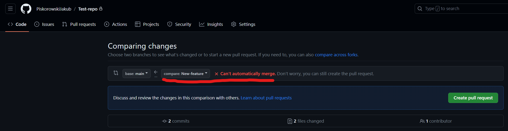

Po stworzeniu nowego **pull request** od razu w komunikacie dostaliśmy informację o tym że wystąpił konflikt w pliku `index.php` oraz że możemy go rozwiązać poprzez edytor w przeglądarce lub **wiersz poleceń.**

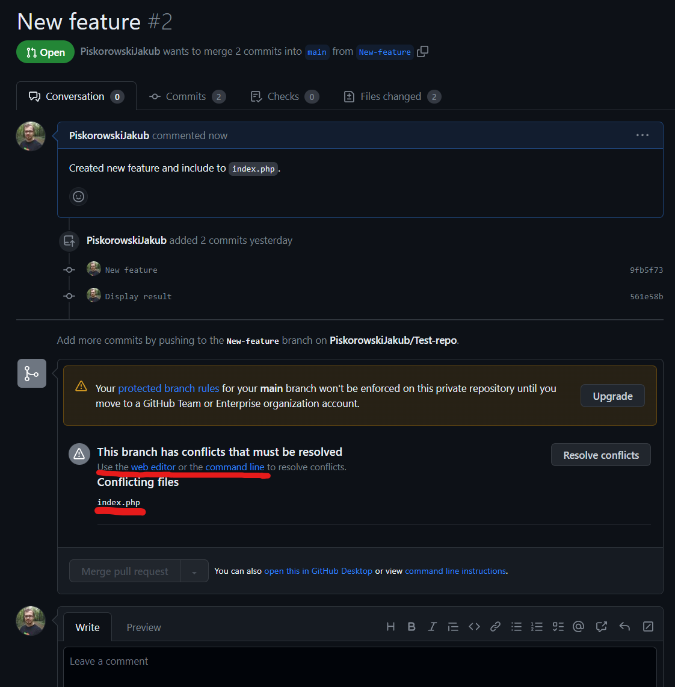

My oczywiście rozwiążemy ten konflikt poprzez wiersz poleceń. 

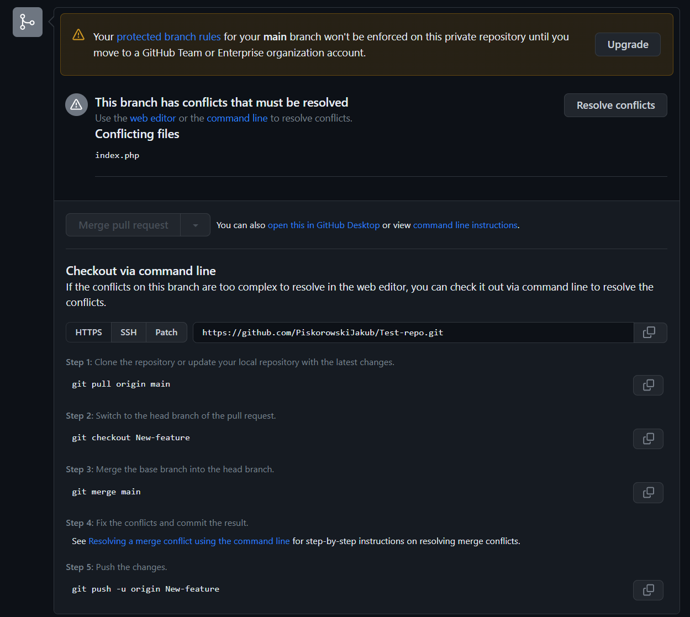

Najpierw musimy pobrać aktualną wersję z **zdalnego repozytorium** na nasze **lokalne repozytorium**.
```bash
git pull
```
Następnie nalezy przełączyć się na naszą drugą gałąź. 
```bash
git checkout New-feature
```
Kolejnym krokiem jest **marge** z gałęzią **main**.
```bash
git merge main
``` 

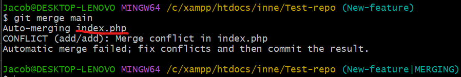

Teraz musimy ręcznie rozwiązać konflikt. W tym celu musimy wejść do pliku `index.php` i zobaczyć co się tam dzieje. 

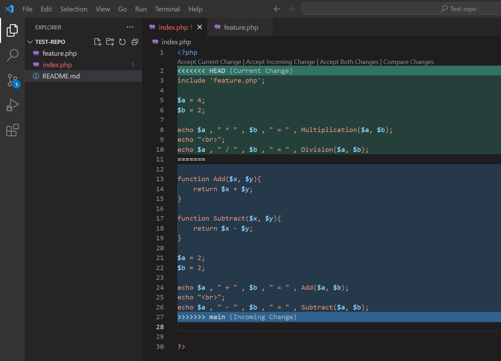

Przyjrzyj się całemu kodowi, wyróżnimy tam kilka zapisów, które zrobił dla nas Git.
```text
<<<<<<< HEAD
```
Oznacza, gdzie zaczyna się wersja z HEAD - czyli brancha, do którego mergujemy, w naszym przypadku jest to main. Czyli łączymy nasz branch **New-feature** do **main**.
```text
=======
```
Oznacza, gdzie kończy się wersja HEAD, a gdzie zaczyna się wersja mergowanego brancha **main**.
```text
>>>>>>> main
```

Oraz ostatni zapis oznaczający gdzie kończy się wersja mergowanego brancha.

Oczywiście takich zapisów może być wiele w jednym pliku i projekcie – występują one wszędzie, gdzie tylko jest konflikt.

### Rozwiązywanie konfliktu…

Jak wziąć się za rozwiązywanie konfliktu?

Musimy podjąć decyzję, którą wersję usunąć, którą zostawić - albo czy może możemy je scalić.

W tym przypadku obie gałęzie wprowadziły nowy feature czyli nie możemy za bardzo nic usunąć. 

W tym celu przeniesiemy sobie wyświetlenie wyniku działania funkcji do **Mnożenia** oraz **Dzielenia** poniżej wyniku działania funkcji **Dodawania** i **Odejmowania**. Obecnie fragment z wyświetlaniem będzie wyglądał następująco. 
```php
echo $a , " + " , $b , " = " , Add($a, $b);
echo "<br>";
echo $a , " - " , $b , " = " , Subtract($a, $b);
echo "<br>";
echo $a , " * " , $b , " = " , Multiplication($a, $b);
echo "<br>";
echo $a , " / " , $b , " = " , Division($a, $b);
```

Oraz usuniemy jedną deklarację zmiennych `a` oraz `b`. Tak aby te zmienne były deklarowane tylko raz z wartościami `4` oraz `2`.

Linijkę z `include` zostawiamy bez zmian na samej górze i zostaje nam usunięcie komentarzy wstawionych przez Git'a. 

Po drobnych modyfikacjach nasz plik wygląda następująco:
```php
<?php
include 'feature.php';

function Add($x, $y){
    return $x + $y;
}

function Subtract($x, $y){
    return $x - $y;
}

$a = 4;
$b = 2;

echo $a , " + " , $b , " = " , Add($a, $b);
echo "<br>";
echo $a , " - " , $b , " = " , Subtract($a, $b);
echo "<br>";
echo $a , " * " , $b , " = " , Multiplication($a, $b);
echo "<br>";
echo $a , " / " , $b , " = " , Division($a, $b);

?>
```

### To jeszcze nie koniec mergowania...

O ile rozwiązaliśmy wszystkie konflikty to naszym obowiązkiem jest teraz **sprawdzić czy, aby na pewno cały kod aplikacji jest poprawny i czy aplikacja działa poprawnia.**

W tym celu musimy sprawdzić czy aplikacji się kompiluje, czy wszystkie testy się wykonują (o ile są napisane wcześniej) oraz można się dodatkowo "przeklikać" przez podstawowe funkcjonalności aplikacji, aby sprawdzić czy nic nie popsuliśmy.

**Nigdy nie omijaj tego punktu** - zawsze sprawdzaj konfliktowy kod - choć **nawet, gdy na pozór wydaje się być wszystko ok!**

Jeśli wszystko mamy już rozwiązane i przetestowane możemy zapisać zmiany na gałąź:
```bash
git add *
git commit -m "Resolve merge conflicts"
```

Teraz możemy przekazać nasze zmiany na zdalne repozytorium:
```bash
git push origin New-feature
```

### Git merge

Jeżeli mamy już rozwiązany nasz konflikt, który został wypchnięty na zdalne repozytorium, możemy zrobić `git merge`, czyli połączyć nasze gałęzie, które już nie mają konfliktów. 

Musimy się teraz przełączyć na naszą gałąź `main`:
```bash
git checkout main
```
Następnie zrobić `git merge` z naszą gałęzią `New-feature`
```bash
git merge New-feature
```
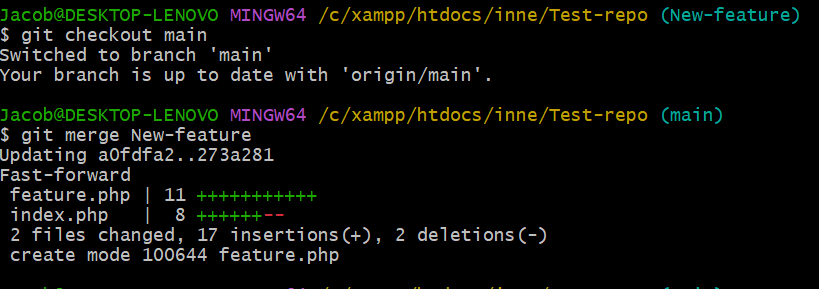
I po poprawnym połaczeniu gałęzi możemy wrzucić te zmiany na zdalne repozytorium:
```bash
git push origin main
```

Tym samym nasz **Pull request** został zamknięty i poprawnie zostały gałęzie połączone.

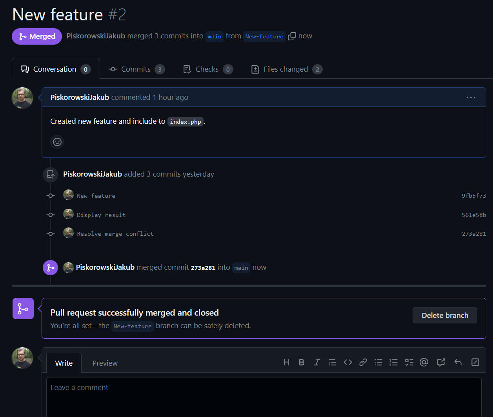

Teraz mamy wszystkie pliki juz aktualne w naszej głównej gałęzi `main`. Możemy bezpiecznie kliknąć **Delete branch** aby usunąć już nie używaną gałąź. 