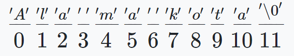

# Programming-course-cpp

`Jakub Piskorowski on 11/01/2022 wersja: 1.0`

## Temat: Tablice znakowe i obiekty string

Przedstawienie czym są tablice znakowe, obiekty string i jak ich używać.

Kod źródłowy: [tablice-znakowe.cpp](tablice-znakowe.cpp)

 `Poziom 2`

Powrót do [Struktury danych](/1-programowanie-strukturalne/1-3-struktury-danych/README.md)

---

## Objaśnienie

### Tablice znaków

**Tablice znaków** służą do przechowywania **ciągów znaków**, czyli tekstu. Przy deklaracji musimy pamiętać, żeby podać o jedną komórkę więcej niż potrzebujemy, ponieważ ciąg znaków musi być zakończony specjalnym znakiem `'\0'` (kod ASCII = 0). Dzięki temu "zakończeniu", między innymi program wie kiedy zakończyć wypisywanie tekstu.

Poniżej przedstawiony jest schemat przechowywania tekstu **"Ala ma kota".** W tym przypadku potrzebujemy co najmniej dwunastu komórek tablicy (pamiętajmy, że numerowanie zaczynamy od zera):



### Wypełnianie tablicy znakami

Tablicę można wypełnić przy deklaracji (podobnie jak inne obiekty), pamiętając o tym szczególnym **znaku na końca tablicy**:

```cpp
#include <iostream>
using namespace std;

int main()
{
    //pierwszy sposób
    char tab[5] = {'a','b','\0'}; //tworzymy tablicę 5-elementową, która może przechować do 4 znaków

    cout<< tab<< endl; //program wypisze ab

    //drugi sposób - nie podając wielkości tablicy - program sam dopasuje jej wielkość
    char tab2[] = {'a','b','\0'}; //tym razem tworzymy tablicę 3-elementową

    cout<< tab2<< endl; 

    //trzeci sposób - podajemy ciąg znaków pamiętając o podwójnym cudzysłowie
    char tab3[] = "Ala ma kota :)";

    cout<< tab3<< endl; //przypisanie do każdego elementu tablicy pojedyńczego znakku

    return 0;
}
```

Wypełnianie tablicy poprzez przypisanie do danych komórek odbywa się tak samo jak na innych typach.

Zauważmy, że przy wyświetlaniu tablicy znaków podajemy tylko nazwę tablicy.

### Wprowadzanie ciągów znaków

Podobnie jak przy wypisywaniu tekstu, do wprowadzania posługujemy się tylko nazwą tablicy. W tym miejscu należy zwrócić uwagę na działanie obiektu "`cin`". Dane zostaną wczytane **do napotkania pierwszej spacji** lub **znaku końca linii.** Oznacza to, że tym sposobem możemy wczytać **tylko jeden wyraz.**

```cpp
#include<iostream>
using namespace std;

int main()
{
    char tablica[100];
    cout << "Podaj imie i nazwisko: "; 
    cin >> tablica;
    cout << "Twoje dane osobowe: "<< tablica << endl; //dane zostaną zredukowane do imienia
    system("pause");
    return 0;
}
```

Wynik działania programu:

```text
Podaj imie i nazwisko: Jakub Piskorowski
Twoje dane osobowe: Jakub
```

### Metoda getline()

Drugim sposobem, jaki można tu zastosować jest wykorzystanie metody `getline()` obiektu `cin`. Funkcja ta jest ukierunkowana na wczytywanie **całych wierszy** i odrzuceniem znaku końca linii. Konstrukcja wygląda następująco:

```cpp
cin.getline(tab, bufor);
```

gdzie `tab` to **tablica znaków**, a `bufor` to **wielkość tej tablicy** (tablica może przechować bufor - 1 znaków + znak końca tablicy).

Przeanalizujmy jeszcze raz nasz program:

```cpp
#include<iostream>
using namespace std;

int main()
{
    char tablica[100];
    cout<<"Podaj imie i nazwisko: "; 
    cin.getline(tablica,100); //wykorzystanie metody getline()
    cout<<"Twoje dane osobowe: "<<tablica<<endl;

    return 0;
}
```

Wynik działania programu:

```text
Podaj imie i nazwisko: Jakub Piskorowski
Twoje dane osobowe: Jakub Piskorowski
```

Źródło: [algorytm.edu.pl](http://www.algorytm.edu.pl/tablice-w-c/tablice-znakow.html)

### Konkatenacja - operator łączenia

Konkatenacja w programowaniu oznacza łączenie dwóch wyrażeń w jedno. Wyrażeniami mogą być np. dwa ciągi znaków ale także liczba i ciąg znaków.

```cpp
string s1 = "C";
char cn[] = "string";
string s = s1 + '-' + cn;
cout << s << endl;

cout << "Length: " << s.length();
```

### Zamiana znaków w stringu

Zmienną typu `String` możemy potraktować jako **tablicę znaków** dzięki temu odwołując się do danego elementu zmiennej `String` możemy dany element zmodyfikować.

```cpp
string s = "Basia";
s[0] = 'K';
for (int i = 0; i < 5; i++) {
    cout << s[i];
}
```
