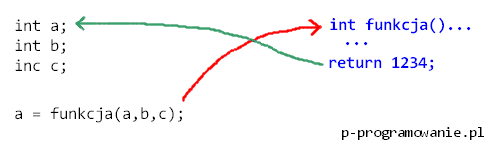
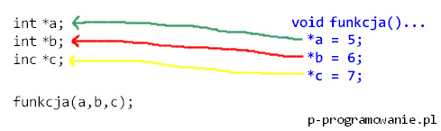

# Programming-course-cpp

`Jakub Piskorowski on 31/12/2021 wersja: 1.1`

## Temat: Wskaźniki

Przedstawienie czym są wskaźniki oraz jak ich używać.

Kod źródłowy:
[wskazniki.cpp](wskazniki.cpp) \
[wskazniki-funkcje.cpp](wskazniki-funkcje.cpp)

 `Poziom 3`

Lista zadań: [135-zadania](135-zadania/README.md)

Zagadnienia: \
&emsp;[1. Wskazniki](#1-wskazniki) \
&emsp;[2. Jak uzywac wskaznikow](#2-jak-uzywac-wskaznikow) \
&emsp;[3. Pusty wskaznik](#3-pusty-wskaznik) \
&emsp;[4. Wskazniki i funkcje](#4-wskazniki-i-funkcje) \
&emsp;[5. Wskazniki i tablice](#5-wskazniki-i-tablice) \
&emsp;[6. Tablice dynamiczne](#6-tablice-dynamiczne) \
&emsp;[7. Przekazywanie tablic jednowymiarowych do funkcji](#7-przekazywanie-tablic-jednowymiarowych-do-funkcji)

Powrót do [Struktury danych](/1-programowanie-strukturalne/1-3-struktury-danych/README.md)

---

## Objaśnienie

### 1 Wskazniki

**Wskaźnik** (ang. pointer) - typ zmiennej odpowiedzialnej za przechowywanie adresu do innej zmiennej (innego miejsca w pamięci) w obrębie naszej aplikacji.

**Wskaźnik** może wskazywać na jakąś zmienną, strukturę, tablicę a nawet funkcję. Jest niczym innym jak zmienną, która nie przechowuje wartości, tylko wskazuje na inną zmienną istniejącą w aplikacji. Oto podstawowe operatory niezbędne do operowania wskaźnikami:

- \* - operator wyłuskania wartości zmiennej, na którą wskazuje wskaźnik (wyciąga wartość ze wskaźnika)
- & - operator pobrania adresu określonej zmiennej

W języku C++ możemy do funkcji **przekazać dowolną ilość parametrów**. Modyfikując parametry w obrębie ciała funkcji **oryginalne zmienne nie zmienią się**. Przekazując zmienne do funkcji poprzez wartość (czyli w sposób standardowy), tworzymy wewnątrz funkcji ich kopię! Co z tego faktu wynika? Każda funkcja w C++ może zmodyfikować maksymalnie jedną zmienną, za pomocą wartości zwracanej return.W języku C++ możemy do funkcji przekazać dowolną ilość parametrów. Modyfikując parametry w obrębie ciała funkcji oryginalne zmienne nie zmienią się. Przekazując zmienne do funkcji poprzez wartość (czyli w sposób standardowy), tworzymy wewnątrz funkcji ich kopię! Co z tego faktu wynika? **Każda funkcja w C++ może zmodyfikować maksymalnie jedną zmienną**, za pomocą wartości zwracanej **return**.

Na poniższym obrazku przedstawiono przekazywanie parametrów do funkcji poprzez wartość. Jesteśmy w stanie zmodyfikować wartość zmiennej a, ale nie jesteśmy w stanie zmienić innych zmiennych.



Co zrobić, aby jedną funkcją zmodyfikować 3 zmienne na raz? Nie można użyć rozkazu return 3 razy, ponieważ każda funkcja zwraca tylko jedną wartość. **W tej sytuacji trzeba skorzystać ze wskaźników**. Jeżeli przekażemy do funkcji jako jej argument **wskaźnik**, wtedy operacje na wskaźniku zmieniają zmienną oryginalną z poza ciała funkcji – nie operujemy na kopii zmiennej. Dzięki temu, nawet jeżeli funkcja jest typu void i nic nie zwraca, możemy **modyfikować wiele zmiennych** z poza ciała funkcji:



### 2 Jak uzywac wskaznikow

**Zmienna wskaźnikowa** (czyli wskaźnik) poprzedzona jest gwiazdką (\**) i **przechowuje adres pamięci** (a nie wartość) zmiennej , na którą wskazuje.

Deklarując **wskaźnik** postępujemy tak jak ze zwykłymi zmiennymi, jednak nazwę wskaźnika poprzedzamy gwiazdką. **Uwaga! Gwiazdka przed nazwą wskaźnika nie ma związku z operatorem wyłuskania!**

```cpp
int telefon;    //zmienna liczbowa
int *wsk;       //zmienna wskaźnikowa typu liczbowego
```

Tak wygląda tworzenie wskaźnika. Utworzone przez nas zmienne są puste. Zmienna `telefon` nie zawiera żadnej wartości a wskaźnik `wsk` nie wskazuje żadnej wartości.

:exclamation: Bardzo ważne jest aby nie korzystać ze wskaźnika który nie wskazuje na żadną zmienną! Prowadzi to zawsze do błędów i niesie ze sobą nieprzewidziane konsekwencje w działaniu programu :exclamation:

Rozbudujmy powyższy przykład:

```cpp
int telefon = 12345;    //zmienna liczbowa
int *wsk = &telefon;    //wskaźnik wsk zawiera adres zmiennej telefon
```

Za pomocą operatora pobrania adresu (`&`) pobraliśmy adres zmiennej `telefon`. Adres zmiennej został przypisany wskaźnikowi `wsk`. Pamiętaj że gwiazdka przed nazwą wskaźnika to nie operator wyłuskania! Chcąc wyświetlić wartość wskaźnika posłużymy się operatorem wyłuskania czyli gwiazdką (`*`).

```cpp
int telefon = 12345;    //zmienna liczbowa
int *wsk = &telefon;    //wskaźnik wsk zawiera adres zmiennej telefon
    
cout << *wsk << endl;
```

Powyższy przykład wyświetli na ekranie wartość zmiennej `telefon`. Przed wyświetleniem wskaźnika został użyty operator wyłuskania. **Pobiera on wartość zmiennej spod adresu ze zmiennej wskaźnikowej.** Bez użycia operatora wyłuskania, została by wyświetlona wartość **zmiennej wskaźnikowej** `wsk` czyli adres zmiennej telefon:

```cpp
int telefon = 12345;         //zmienna liczbowa
int *wsk = &telefon;         //przypisanie wskaźnikowi adresu zmiennej telefon

cout << *wsk << endl;        //wyświetlenie wyłuskanej wartości wskaźnika (12345)
cout << wsk << endl;         //wyświetlenie adresu zmiennej telefon
cout << &wsk << endl;        //wyświetlenie adresu wskaźnika
cout << &telefon << endl;    //wyświetlenie adresu zmiennej telefon
```

Używając `sizeof()` na **wskaźniku** nie mozna zapomnieć o operatorze wyłuskania. W przeciwnym wypadku wynikiem zawsze będzie ta sama wartość, ponieważ każda **zmienna wskaźnikowa** ma ten sam rozmiar w pamięci.

Wartość wskaźnika (zmiennej na którą wskazuje) możemy modyfikować bez uzycia nazwy zmiennej:

```cpp
int telefon = 12345;    //zmienna liczbowa
int *wsk = &telefon;    //wskaźnik wsk zawiera adres zmiennej telefon

*wsk = 666;

cout << *wsk << endl;
```

### 3 Pusty wskaznik

Przed zapisaniem wartości do wskaźnika, czyli zapisaniu wartości do zmiennej na którą wskazuje wskaźnik, należy się upewnić, że wskaźnik nie jest pusty.

:exclamation: **Totalnie błędna** byłaby sytuacja, kiedy chcemy nadać zmiennej wskaźnikowej określoną wartość, bez wcześniejszego przypisania wskaźnika do zmiennej. :exclamation:

```cpp
int *wsk;
*wsk = 666; //źle!!
```

---

### 4 Wskazniki i funkcje

W języku C++ przekazujemy argumenty do funkcji poprzez tzw. **przekazywanie przez wartość.** W języku C oraz C++ możemy przekazywać wartości do funkcji poprzez **przekazywanie przez wskaźnik.** Wskaźnik będzie wtedy argumentem funkcji.

Plik: [wskazniki-funkcje.cpp](wsazniki-funkcje.cpp)

```cpp
#include <iostream>

using namespace std;

// funkcja przyjmuje jako argument wskaźnik
void zwieksz_liczbe (int *liczba)
{
    *liczba+= 5;
}

int main()
{
    int numerek = 5;
    int *wsk = &numerek;
    
    zwieksz_liczbe(wsk); //przekazujemy wskaźnik (bez operatorów)
    
    cout << numerek << endl;
    
    zwieksz_liczbe(&numerek); //przekazujemy bezpośrednio adres zmiennej (operator &)
    
    cout << numerek << endl;
    
    return 0;
}
```

Należy zwrócić uwagę, że do funkcji której argumentem jest wskaźnik, przekazujemy adres zmiennej za pomocą operatora pobrania adresu (`&`) a nie samą wartość.

---

### 5 Wskazniki i tablice

Tablice są sciśle związane ze wskaźnikami. Nazwa tablicy to wskaźnik na jej pierwszy element. Oznacza to że możemy wyświetlić pierwszy element tablicy umieszczając operator wyłuskania(``*``) przed jej nazwą:

```cpp
int tablica[5] = {1, 2, 3, 4, 5};
cout << *tablica << endl;
```

Możemy także tworzyć wskaźniki do określonych elementów tablicy:

```cpp
int tablica[5] = {1, 2, 3, 4, 5};
int *wsk = &tablica[3];

cout << *wsk << endl;
```

Często spotykane są także tablice wskaźników. Ich tworzenie jest proste i analogiczne do innych typów zmiennych:

```cpp
#include <iostream>

using namespace std;

int main()
{
    int liczba1 = 1, liczba2 = 2, liczba3 = 3;
    int *wsk[3];
    
    wsk[0] = &liczba1;
    wsk[1] = &liczba2;
    wsk[2] = &liczba3;
    
    cout << *wsk[1] << endl;
    return 0;
}
```

Źródło: [p-programowanie.pl](https://www.p-programowanie.pl/cpp/wskazniki)

---

### 6 Tablice dynamiczne

**Tablice statyczne** nie dają nam możliwości decydowania o ich wymiarach podczas działania programu. Oznacza to że musimy znać wielkość tablicy na poziomie tworzenia aplikacji.

Deklarując **tablicę dynamiczną** należy zadeklarować wskaźnik tego samego typu co elementy tablicy. Następnie rezerwujemy miejsce w pamięci o określonym typie (takim samym jak wskaźnik). Służy do tego rozkaz ``new``. Tablicy dynamicznej używamy tak samo jak zwykłą tablice statyczną, nie trzeba operować wskaźnikami, wskaźniki potrzebne są **tylko przy deklaracji**. Wynika to z faktu iż tablica statyczna to też wskaźniki chociaż nie są do końca widoczne.

```cpp
int * tablica = new int[3];

tablica[0] = 11;
tablica[1] = 12;
tablica[2] = 13;

delete [] tablica;
```

Każdy dynamiczny obiekt utworzony podczas działania programu należy na końcu  usunąć poleceniem ``delete``. Przy usuwaniu tablicy dodatkowo dodajemy kwadratowy nawias czyli ``delete []``. Dzięki użyciu tablicy dynamicznej użytkownik ma możliwość decydowania o rozmiarze tablicy podczas działania programu:

```cpp
int rozmiar;

cout << "Podaj rozmiar tablicy:" << endl;
cin >> rozmiar;

int * tablica = new int[rozmiar];

delete [] tablica;
```

Źródło: [p-programowanie.pl](https://www.p-programowanie.pl/cpp/tablice-dynamiczne)

---

### 7 Przekazywanie tablic jednowymiarowych do funkcji

W C++ mamy do dyspozycji kilka form zapisu przekazywania **tablic do funkcji**. Poznamy trzy sposoby zapisu osiągnięcia naszego celu. Zapisy, które zostaną przedstawione są względem siebie równoważne, a więc można ich używać zamiennie. Zapisy te wyglądają następująco:

```cpp
void sposob_1( int tablica[ 123 ] );
void sposob_2( int tablica[] );
void sposob_3( int * tablica );
```

Jeżeli wykazałeś się kreatywnością rozwiązując zadanie z poprzedniego rozdziału to prawdopodobnie wystąpił w nim zapis, który występuje w funkcji sposob_1, tj. ``int tablica[ 123 ]``, gdzie **123** to liczba elementów w tablicy. Z punktu widzenia funkcji znajomość liczby elementów dla tablic jednowymiarowych jest zbędna. Wspomniany zapis zadziała więc tak samo jak zapis ``int tablica[]``, który informuje kompilator jak również programistę o przekazywaniu tablicy do funkcji. Ostatni zapis ``int * tablica`` natomiast mówi, że jest to wskaźnik na zmienną - szczegółów na chwilę obecną nie musisz znać. Jedyne co Ciebie powinno teraz interesować to fakt, że zapis ten jest również równoważny do wcześniej omówionych.

:exclamation: Kompilator wszystkie omówione zapisy zinterpretuje jako wskaźnik. Wskaźnik w rzeczywistości jest liczbą, która wskazuje na pierwszą komórkę pamięci zawierającą dane.

**Tablice** przekazywane do funkcji **nigdy nie są kopiowane**. Oznacza to, że w funkcji masz bezpośredni dostęp do danych, które znajdują się w tablicy. **Modyfikacja danych jest globalna,** bowiem pracujesz na oryginalnych danych tablicy, która została przekazana do funkcji.

```cpp
#include <iostream>
using namespace std;

void wypelnijTablice( int t[], int iRozmiar )
{
    cout << "Podaj " << iRozmiar << " liczb:" << endl;
    int i = 0;
    do
    {
        cin >> t[ i ];
        i++;
    } while( i < iRozmiar );
   
}

int main()
{
    int moja_tablica[ 5 ];
    wypelnijTablice( moja_tablica, 5 );
    int i = 0;
    do
    {
        cout << moja_tablica[ i ] << ", ";
        i++;
    } while( i < 5 );
   
    return 0;
}
```

Źródło: [cpp0x.pl](https://cpp0x.pl/kursy/Kurs-C++/Poziom-2/Przekazywanie-tablic-jednowymiarowych-do-funkcji/324)

:exclamation: Nazwa tablicy jest równocześnie adresem zerowego elementu.

```cpp
cout << "Adres tablicy: " << &tab[0] << endl;
cout << "Adres tablicy: " << tab << endl;
```
