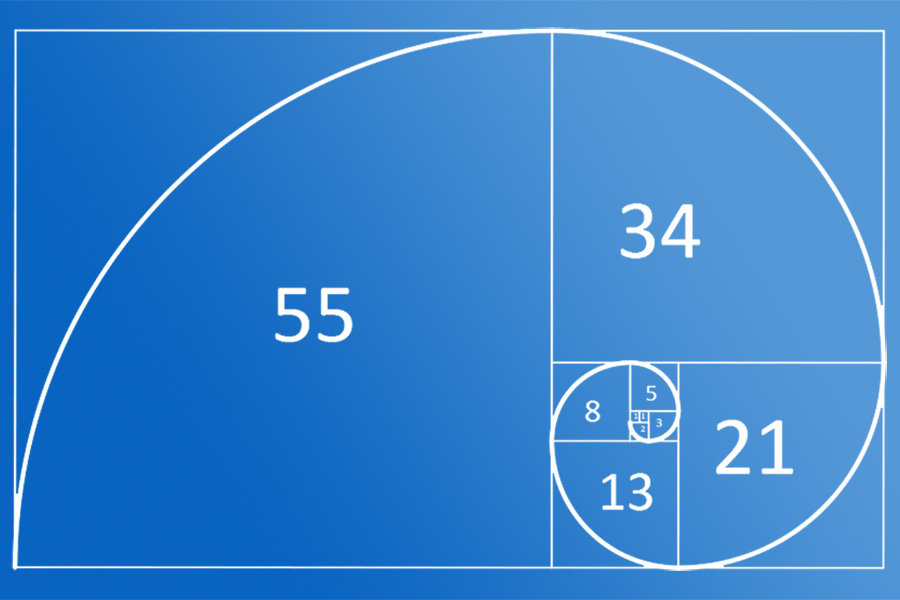

# Programming-course-cpp

`Jakub Piskorowski on 28/02/2022 wersja: 1.1`

## Temat: Ciąg Fibonacciego

Przedstawienie działania algorytmu ciągu Fibonacciego

Kod źródłowy:
[ciag-fibonacciego.cpp](ciag-fibonacciego.cpp)

&#x1F4D2; Poziom 1

Powrót do [Podstawowe algorytmy](/2-algorytmika/2-2-podstawowe-algorytmy/README.md)

---

## Objaśnienie

Leonardo Fibonacci był włoskim matematykiem żyjącym w latach od 1175 do 1250. Jest on autorem specyficznego ciągu liczbowego, który pojawia się w wielu zastosowaniach informatycznych (i nie tylko ).

**Ciąg Fibonacciego** to szczególny rodzaj ciągu liczb naturalnych. Liczby tego ciągu nazywane są liczbami Fibonacciego. Spotykane są w wielu dziedzinach i sytuacjach np. w matematyce, w przyrodzie, na rynkach giełdowych.

Przykłady graficzne reprezentacji złotego podziału.

 \
Żródło: [e-kursy-walut.pl](https://e-kursy-walut.pl/warto-wiedziec/poziomy-fibonacciego-dzialaja-na-bitcoinie/) \
Spirala poziomów Fibonacciego

 \
Żródło: [ciekawe.org](https://ciekawe.org/2016/06/18/geometria-roslin-ciag-fibonacciego-w-przyrodzie/) \
Zloty podział w naturze

:exclamation: **Ciąg Fibonacciego** to ciąg liczb, w którym pierwszy wyraz jest równy 0, drugi jest równy 1 a każdy następny jest sumą dwóch poprzednich.

Oto kilka pierwszych wyrazów ciągu Fibonacciego:

```text
0, 1, 1, 2, 3, 5, 8, 13, 21, 34, 55, 89, 144, 233, 377, 610, 987, 1597, 2584...
```

Obliczając `n-ty` wyraz ciągu, musisz posługiwać się wartościami poprzednimi czyli `n-1`, `n-2` itd. aż dojdziesz do wartości które znasz. Są nimi wartości dla `F0` i `F1`.

---

## Algorytm generacji liczb Fibonacciego metodą iteracyjną

**Wejście:**\
`n` – numer liczby ciągu Fibonacciego do wyliczenia, `n` ∈ N.

**Wyjście:**\
`n` - ta liczba ciągu Fibonacciego.

**Zmienne pomocnicze:**\
`f0`, `f1`, `f` – kolejne trzy liczby Fibonacciego, f0, f1, f∈C.

**Lista kroków:**\
K1: &emsp; `f0 ← 0` &emsp; pierwsza lub f i-2 liczba Fibonacciego \
K2: &emsp; `f1 ← 1` &emsp; druga lub f i-1 liczba Fibonacciego \
K3: &emsp; `Dla i = 0, 1, ..., n:` \
&emsp; &emsp; &emsp; `wykonuj kroki K4...K9` \
K4: &emsp; `Jeśli i > 1,` \
&emsp; &emsp; &emsp; `to wykonuj kroki K6 do k8` \
K5: &emsp; `inaczej f ← i` \
&emsp; &emsp; &emsp; `i następny obieg pętli K3` \
K6: &emsp; `f ← f0 + f1` &emsp; obliczamy kolejną liczbę Fibonacciego \
K7: &emsp; `f0 ← f1` &emsp; zapamiętujemy wyniki obliczeń pośrednich \
K8: &emsp; `f1 ← f` &emsp; dla następnego obiegu pętli \
K9: &emsp; `Pisz f` &emsp; wypisujemy liczbę ciągu\
K10: &emsp; `Zakończ`

Wynik działania programu:

```text
Ile wyrazow ciagu wypisac: 10
0
1
1
2
3
5
8
13
21
34
55
```

Kod źródłowy: [ciag-fibonacciego.cpp](ciag-fibonacciego.cpp)

<!--Źródło: [matura-informatyka.pl](https://www.matura-informatyka.pl/programowanie/ciag-liczby-fibonacciego)-->