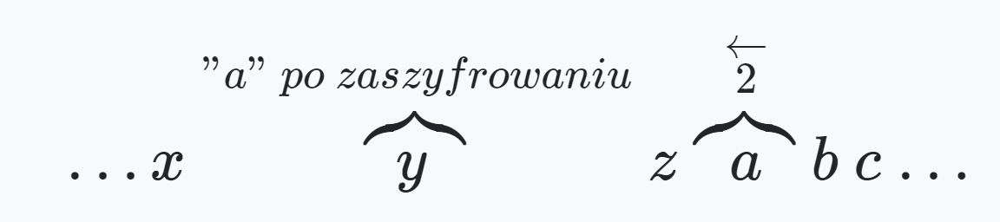
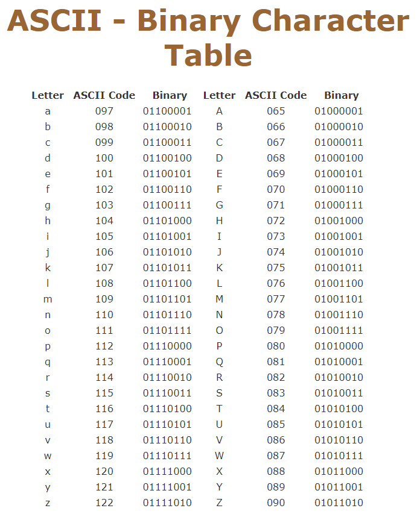

# Programming-course-cpp

`Jakub Piskorowski on 23/02/2022 wersja: 1.1`

## Temat: Szyfr Cezara

Przedstawienie działania szyfru Cezara.

Kod źródłowy:
[szyfr-cezara.cpp](szyfr-cezara.cpp)

&#x1F4D7; Poziom 2

Powrót do [Podstawowe algorytmy](/2-algorytmika/2-2-podstawowe-algorytmy/README.md)

---

## Objaśnienie

Zacznijmy od wyjaśnienia idei szyfru Cezara. Jest to jeden z najprostszych szyfrów przesuwających. Polega ona na przesunięciu każdej litery o pewną stałą wartość zwaną kluczem. Prześledźmy przykład:

Zaszyfrujmy słowo Marcin kluczem o wartości równej `-2`. A więc każdą literę przesuwamy w lewą stronę o dwie wartości:

Przed szyfrowaniem &emsp; Po szyfrowaniu \
&emsp; M &emsp;&emsp;&emsp; K \
&emsp; a &emsp;&emsp;&emsp; y \
&emsp; r &emsp;&emsp;&emsp; p \
&emsp; c &emsp;&emsp;&emsp; a \
&emsp; i &emsp;&emsp;&emsp; g \
&emsp; n &emsp;&emsp;&emsp; l

Oczywiście szyfrowanie odbywa się w zakresie liter alfabetu łacińskiego. Aby zaszyfrować literę `a` należy się cofnąć do końca alfabetu i będzie to litera `y`:




Źródło: [sticksandstones.kstrom.com](http://sticksandstones.kstrom.com/appen.html)

Słowo **"Marcin"** po zaszyfrowaniu wygląda następująco: **"Kypagl"**.

Aby zdeszyfrować dane słowo należy przesunąć każdy znak o

**−klucz**,

czyli w tym przypadku o

**−(−2)=2**

Szyfr Cezara jest szyfrem symetrycznym, ponieważ do szyfrowania i deszyfrowania wykorzystujemy ten sam klucz, dodatkowo jest to szyfr podstawieniowy (litery nie zmieniają swojego położenia, tylko zostają podmienione na inne).

## Funkcja szyfrująca i deszyfrująca

**Wejście:** \
`klucz` - liczba określająca o ile przesunąć każdy znak (`klucz` szyfrowanie, `-klucz` deszyfrowanie), \
`tab` – tablica znaków, przechowująca maksymalnie 1000 znaków.

**Wyjscie:** \
`tab` - tablica z podmienionymi znakami.

**Zmienne pomocnicze:** \
`dl` – przechowujący rozmiar tablicy znaków.

**Lista kroków:** \
k1: &emsp; `dl ← rozmiar(tab)`, \
k2: &emsp; `Jeśli (nie) klucz >= -26 oraz klucz <= 26`, \
&emsp; &emsp;&emsp; `to wyjdź`,

k3: &emsp; `Jeśli klucz >= 0`, \
&emsp; &emsp; `wykonuj kroki od k4 do k5`,

k4: &emsp;&emsp; `Dopóki i < dl`, \
&emsp; &emsp;&emsp; `wykonuj krok k5` \
k5: &emsp;&emsp; `Jeśli tab + klucz <= z`, \
&emsp; &emsp;&emsp; `to tab += klucz`, \
&emsp; &emsp;&emsp; `inaczej tab ← tab + klucz - 26`,

k6: &emsp; `inaczej`, \
k7: &emsp;&emsp; `Dopóki i < dl`, \
&emsp; &emsp;&emsp; `wykonuj krok k8` \
k8: &emsp;&emsp; `Jeśli tab + klucz >= a`, \
&emsp; &emsp;&emsp; `to tab += klucz`, \
&emsp; &emsp;&emsp; `inaczej tab ← tab + klucz + 26`,

Wynik:

```text
Podaj wyraz skladajacy sie z malych liter: marcin
Podaj klucz z przedzialu [-26..26]: -2
Po zaszyfrowaniu: kypagl
Po rozszyfrowaniu: marcin
```

Kod źrodłowy: [szyfr-cezara.cpp](szyfr-cezara.cpp)

<!--Źródło: [algorytm.edu.pl](http://www.algorytm.edu.pl/algorytmy-maturalne/szyfr-cezara.html) -->
