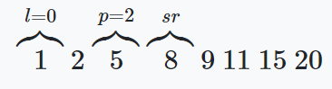
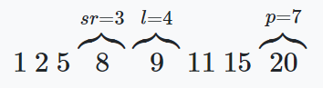

# Programming-course-cpp

`Jakub Piskorowski on 07/04/2022 wersja: 1.0`

## Temat: Wyszukiwanie binarne

Przedstawienie działania algorytmu wyszukiwania binarnego

Kod źródłowy:
[wyszukiwanie-binarne.cpp](wyszukiwanie-binarne.cpp)

 `Poziom 1`

Powrót do [Algorytmy wyszukiwania](/2-algorytmika/2-3-algorytmy-wyszukiwania/README.md)

---

## Objaśnienie

Algorytm szuka danego elementu w tablicy uporządkowanej (posortowanej). Jest realizowany metodą **"dziel i zwyciężaj"**. Dzieli on tablicę na mniejsze podtablice do momentu wyszukania pozycji (lub nie w przypadku gdy taki element nie istnieje) elementu szukanego.

Przeanalizujmy następujący zbiór 8 uporządkowanych liczb:

1 2 5 8 9 11 15 20

Potrzebne będą nam trzy zmienne pomocnicze:

l − przechowuje numer lewego krańca tablicy, \
r − przechowuje numer prawego krańca tablicy, \
sr − przechowuje numer środkowego elementu tablicy.

W pierwszym kroku algorytmu ustawiamy:

```cpp
int l = 0;
int p = 7;
int sr = (l+p)/2;
```

A więc mamy: \


Następnie sprawdzamy czy szukany element znajduje się na pozycji **sr**. Jeśli tak to znaleźliśmy daną liczbę, w przeciwnym przypadku sprawdzamy czy szukana liczba jest mniejsza czy większa niż liczba znajdująca się na środkowej pozycji.

Jeśli jest mniejsza, tzn., że mamy do przeszukania lewą część badanej tablicy. Zmieniamy wartość zmiennej.

p = sr−1

a więc: \


W przypadku gdy jest większa to przeszukujemy prawą część tablicy. Zmieniamy wartość zmiennej `l` na: \
`l = sr + 1`

a więc: \


Czynność tą powtarzamy do momentu znalezienia szukanej wartości, lub gdy zmienne `l` i `r` spełnią warunek: `l > r`. W takim przypadku element nie występuje w zbiorze liczb.

<!--Źródło: [algorytm.edu.pl](http://www.algorytm.edu.pl/algorytmy-maturalne/wyszukiwanie-binarne.html) -->

## Funcja algorytmu wyszukiwania binarnego

**Wejście:** \
`szukana` - poszukiwana liczba \
`tab[15]` - tablica z posortowanymi wartościami (2, 3, 5, 7, 11, 13, 17, 19, 23, 29, 31, 37, 41, 43, 47)

**Wyjście:** \
`pozycja` - indeks (pozycja) tablicy na której znajduje się poszukiwana wartość

**Zmienne pomocnicze:** \
`l` − przechowuje indeks lewego krańca tablicy, \
`p` − przechowuje indeks prawego krańca tablicy, \
`sr` − przechowuje indeks środkowego elementu tablicy

**Lista kroków:**\
K1: &emsp; `l ← 0` &emsp; \
K2: &emsp; `p ← 15` &emsp; \
K3: &emsp; `sr ← (l+p)/2` &emsp; \
K4: &emsp; `Dopóki l <= p` &emsp; \
&emsp; &emsp; &emsp; `wykonuj kroki od K5 do K7` \
K5: &emsp; `Jeśli tab[sr] = szukana` &emsp; \
&emsp; &emsp; &emsp; `zwróć sr` \
K6: &emsp; `Jeśli tab[sr] > szukana` &emsp; \
&emsp; &emsp; &emsp; `to p ← sr - 1` \
&emsp; &emsp; &emsp; `inaczej l ← sr + 1` \
K7: &emsp; `sr ← (l+p)/2` &emsp; \
K8: &emsp; `zwróć -1` &emsp;

Wynik działania programu:

```text
Podaj liczbe ktora chcesz znalezc: 29
Liczba 29 wystepuje w zbiorze w komorce o indeksie 9
```

Kod źródłowy: [wyszukiwanie-binarne.cpp](wyszukiwanie-binarne.cpp)
