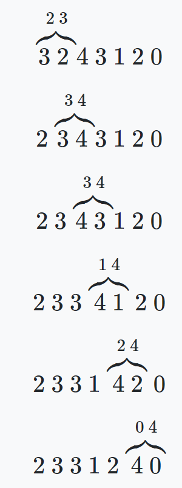

# Programming-course-cpp

`Jakub Piskorowski on 05/06/2022 wersja: 1.0`

## Temat: Sortowanie bąbelkowe

Przedstawienie działania algorytmu sortowania bąbelkowego

Kod źródłowy:
[sortowanie-babelkowe.cpp](sortowanie-babelkowe.cpp)

&#x1F4D5; Poziom 3

Powrót do [Algorytmy sortowania](/2-algorytmika/2-4-algorytmy-sortowania/README.md)

---

## Objaśnienie

Sortowanie bąbelkowe jest jednym z najprostszych w implementacji algorytmów porządkujących dane. Oznacza to, że sortowanie bąbelkowe nie poradzi sobie z porządkowaniem większych zbiorów.

Nazwa wzięła się stąd, że dane podczas sortowania - tak jak bąbelki w napoju gazowanym - przemieszczają się ku prawej stronie i układają się w odpowiednim szyku. \
Algorytm działa następująco:

w każdym przejściu pętli wewnętrznej porównywane są ze sobą dwie kolejne wartości i w razie potrzemy są zamieniane miejscami. W jednym cyklu pętli wewnętrznej, największa liczba (tak jak bąbelki w napoju gazowanym) w zbiorze będzie się przemieszczała na ostatnią pozycję. W ten sposób otrzymujemy podzbiór częściowo już posortowany. Czynności te powtarzamy dla zbioru pominiętego o elementy już poukładane. Prześledźmy przykład:

posortujemy tą metodą następujące dane

`3 2 4 3 1 2 0`

Pętla wewnętrzna porówna sąsiadujące ze sobą elementy. Dla `n` elementów zostanie wykonanych `n − 1` porównań:



sytuacja po pierwszym cyklu pętli wewnętrznej:

`2 3 3 1 2 0 4`

Największa liczba (w tym przypadku `4` ) przesunęła się na ostatnią pozycję. Został nam teraz do posortowania zbiór elementów pominięty o tą liczbę. Powtarzamy teraz czynności dla `n − 1` elementów. W ten sposób liczba `3` wskoczy  na przedostatnią pozycję. Powtarzamy te kroki, aż otrzymamy zbiór posortowany.

<!-- Źródło: [algorytm.edu.pl](https://www.algorytm.edu.pl/algorytmy-maturalne/sortowanie-babelkowe.html) -->

---

## Implementacja

**Wejście:** \
`tab` - tablica z losowymi wartościami liczb całowitych \
`n` - rozmiar tablicy

**Zmienne pomocnicze:** \
`temp` - zmienna tymczasowa wykorzystywana przy zamianie elementów

**Lista kroków:**\
K1: &emsp; `Dla i = 0,1,... n` &emsp; Pętla zewnętrzna, powtarza się tyle ile jest elementów w tablicy \
&emsp; &emsp; &emsp; &emsp; `wykonuj kroki od K2 do K6` \
K2: &emsp; `Dla j = 0,1,... n-i` &emsp; Pętla wewnętrzna, przechodzi za każdym razem po n-1 elementów \
&emsp; &emsp; &emsp; &emsp; `wykonuj kroki od K3 do K6` \
K3: &emsp; `Jeżeli tab[j-1] < tab[j]` &emsp; jeżeli poprzedni element jest większy od obecnego\
&emsp; &emsp; &emsp; &emsp; `to wykonuj kroki od K4 do K6` &emsp; zamiana wartości \
K4: &emsp; `temp ← tab[j-1]` \
K5: &emsp; `tab[j-1] ← tab[j]` \
K6: &emsp; `tab[j] ← temp` \

Wynik działania programu:

```text
Wprowadz liczbe elementow do posortowania: 10

Tablica przed posortowaniem:
21 | 57 | 54 | 92 | 89 | 24 | 99 | 19 | 20 | 63 |

Rozpoczecie sortowania

Tablica po sortowaniu:
19 | 20 | 21 | 24 | 54 | 57 | 63 | 89 | 92 | 99 |
```

<!--
Kod źródłowy: [sortowanie-babelkowe.cpp](sortowanie-babelkowe.cpp) -->
