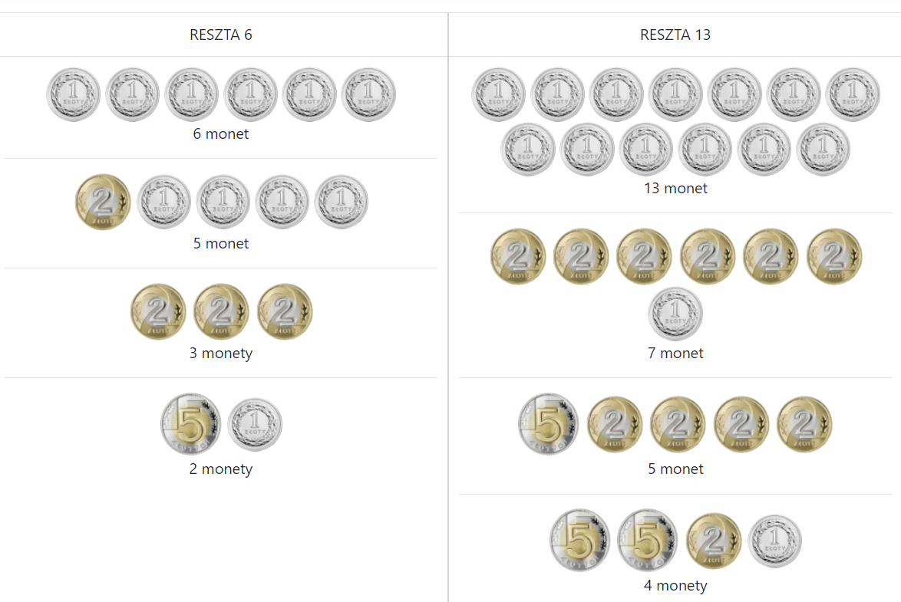

# Programming-course-cpp

`Jakub Piskorowski on 14/04/2022 wersja: 1.0`

## Temat: Algorytm wydawania reszty

Przedstawienie działania algorytmu wydawania reszty

Kod źródłowy:
[wydawanie-reszty.cpp](wydawanie-reszty.cpp)

 `Poziom 1`

Powrót do [Inne algorytmy](/2-algorytmika/2-5-inne-algorytmy/README.md)

---

## Objaśnienie

### Wydawanie reszty

Problem:
Jak dostępnymi monetami wydać resztę w taki sposób, by użyć ich jak najmniej.
Jakie będzie rozwiązanie dla reszty 6, a jakie dla 13?




Widać zatem, że powinniśmy rozpocząć wydawanie reszty od najwyższych nominałów.

Nasz algorytm przyjmie liczbę, która będzie oznaczała resztę, którą mamy wydać klientowi. Przy pomocy algorytmu wyznaczymy ile jakich nominałów użyć, aby wydać jak najmniej banknotów i monet. W celu ułatwienia sobie zadania przyjmujemy, że kwota do wydania jest podana w złotówkach. Listą wartości odpowiednich nominałów będziemy przechowywać na liście uporządkowanej malejąco.

---

## Algorytm wydawania reszty

**Wejście:** \
`kwota` - kwota do wydania w banknotach

**Wyjście:** \
`nominaly[]` - nominaly do wydania

**Zmienne pomocnicze:** \
`ile` - ile razy wydać dany nominał \
`i` - rozpatrywanie kolejnych nominałów

**Lista kroków:**

K1: &emsp; `nominaly[] ← 500, 200, 100, 50, 20, 10, 5, 2, 1` &emsp; określenie dostępnych nominałów \
K2: &emsp; `Dopóki kwota > 0` &emsp; dopóki nie wydano całej reszty \
&emsp; &emsp; &emsp; `wykonuj kroki od K3 do K7` \
k3: &emsp; `Jeśli kwota >= nominaly[]` &emsp; sprawdz czy można wydać danym nominałem \
&emsp; &emsp; &emsp; `wykonuj kroki od K4 do K6` \
K4: &emsp; `ile ← kwota / nominaly[]` &emsp; ile razy wydać dany nominał \
K5: &emsp; `kwota ← kwota - ( nominaly[] * ile )` &emsp; zmniejsz resztę o dany nominał \
K6: &emsp; `Pisz nominaly oraz ile` &emsp; wypisz nominał i ile razy \
K7: &emsp; `i  ← i + 1` &emsp; rozpatrz kolejny nominał \
K8: &emsp; `Zakończ`

Wynik:

```text
Podaj reszte do wyplacenia: 349
200 x 1
100 x 1
20 x 2
5 x 1
2 x 2
```

Kod źródłowy: [wydawanie-reszty.cpp](wydawanie-reszty.cpp)

<!-- Źródło: [algorytm.org](http://www.algorytm.org/inne/problem-wydawania-reszty/reszta-c.html) -->