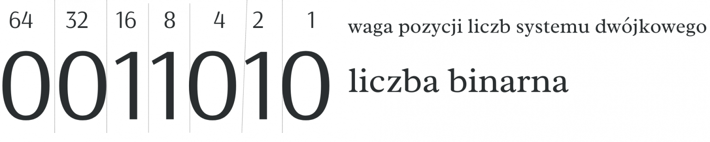
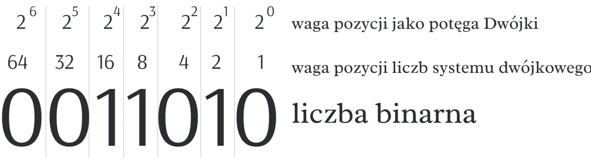
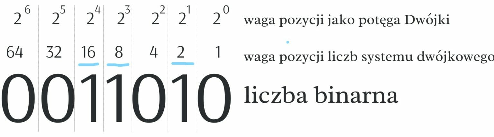
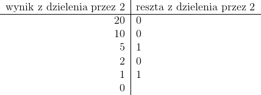

# Programming-course-cpp

`Jakub Piskorowski on 24/10/2023 wersja: 1.0`

## Temat: Dziesiętna na binarną

Przedstawienie działania algorytmu  zamiany liczby dziesiętnej na binarną.

Kod źródłowy:
[decimal-to-binary.cpp](./decimal-to-binary.cpp)

&#x1F4D7; Poziom 2

Powrót do [Algorytmika](/2-algorytmika/README.md)

---

## Objaśnienie

**System binarny** lub system dwójkowy, to sposób zapisu liczby całkowitej oparty o zera i jedynki, wskazujące kolejne potęgi liczby 2 występujące na kolejnych pozycjach liczby całkowitej.

W systemie binarnym do zapisu liczby używamy cyfr 0 i 1 , w którym każda pozycja cyfr składających się na liczby jest określona kolejną potęgą dwójki (a po prawej stronie, jak w systemie dziesiętnym są cyfry z najmniejszą wagą pozycji).

Zapis liczby binarnej (liczby dwójkowej) tworzymy z cyfr będących do dyspozycji w systemie binarnym. Na przykład liczba 11010 w systemie binarnym będzie przedstawiona jako:



W systemie dwójkowym zapis liczby binarnej 11010 oznacza w systemie dziesiętnym 26. Jak to policzyliśmy? Jedynka na pozycji szesnastek potem jedynka na pozycji ósemek i jedynka na pozycji dwójek.



| 0 | 0 | 1 | 1 | 0 | 1 | 0 | – liczba binarna (dziesiętnie 16+8+2=26) czyli:



## Algorytm zamiany liczby dziesiętnej na binarną

Dla przykładu zamieńmy liczbę 20 na liczbę binarną.

W jednym kroku algorytmu wykonujemy dwie czynności:

- wyznaczamy resztę z dzielenia przez 2 konwertowanej liczby
- konwertowaną liczbę dzielimy przez 2 (dzielenie całkowite)

Daną czynność wykonujemy tak długo, jak długo liczba dziesiętna jest większa od 0.

Przykład zamiany liczby 20 jest przedstawiony poniżej:



Następnym krokiem jest spisanie reszt (z dołu do góry), czyli:

20 = (10100)^2

Do rozwiązania problemu posłużymy się tablicą, a następnie wyświetlimy jej zawartość w odwrotnej kolejności. Załóżmy, że typ int składa się z 4 bajtów, czyli maksymalnie możemy uzyskać 31 bitów (jeden bit przeznaczony jest na znak liczby).

## Funkcja konwersji liczby dziesiętnej na binarną

**Wejście:**\
`liczba` – liczba dziesietna 

**Lista kroków:**\
K1: &emsp; `tab[15]` &emsp; deklaracja tablicy o rozmiarze 31 \
K2: &emsp; `i ← 0` &emsp; deklaracja iteratora \
K3: &emsp; `dopóki liczba jest różna od zera` \
&emsp; &emsp; &emsp; `wykonuj kroki k4...k5` \
K4: &emsp; `tab[i++] ← liczba modulo 2` &emsp; zapisujemy resztę z dzielenia w kolejnym elemencie tablicy \
K5: &emsp; `liczba ← liczba / 2` \
K6: &emsp; `od j ← i-1 do j >=0` \
&emsp; &emsp; &emsp; `wykonuj krok k7` \
K7: &emsp; `wyświetl element tablicy z indeksem j`


Wynik działania programu:

```text
Podaj liczbe dziesietna: 26
Liczba 26 po zamianie na postac binarna: 11010
```

Kod źródłowy: [decimal-to-binary.cpp](./decimal-to-binary.cpp)

<!--
Źródło: [algorytm.edu.pl](https://www.algorytm.edu.pl/funkcje/69-zamiana-liczby-dziesietnej-na-binarna.html)
-->