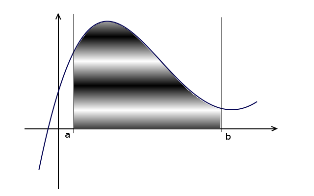
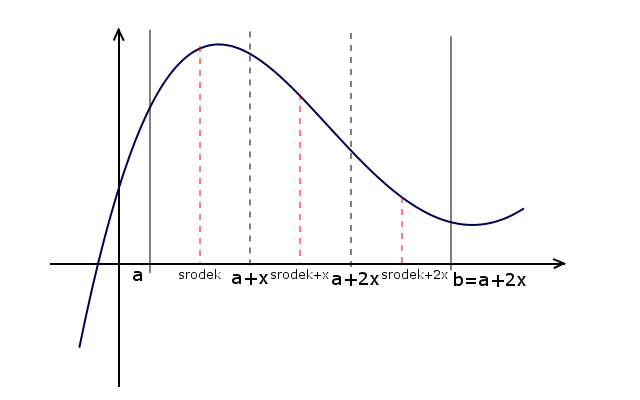
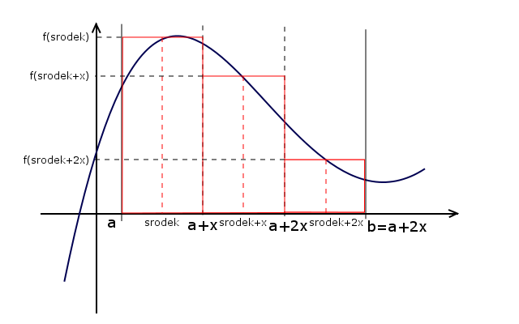
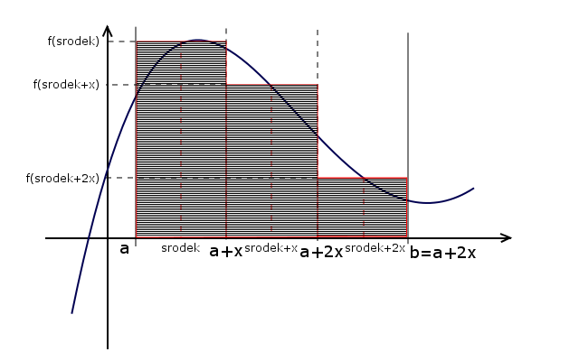

# Programming-course-cpp

`Jakub Piskorowski on 03/11/2023 wersja: 1.0`

## Temat: Całkowanie numeryczne - metoda prostokątów

Przedstawienie działania algorytmu znajdowanie miejsca zerowego metodą połowienia przedziałów

Kod źródłowy:
[set-precision.cpp](./set-precision.cpp) \
[calkowanie-numeryczne.cpp](./calkowanie-numeryczne.cpp)


&#x1F4D5; Poziom 3

Powrót do [Algorytmika](/2-algorytmika/README.md)

---

## Objaśnienie

Jednym ze sposobów wyznaczenia pola obszaru ograniczonego wykresem funkcji, osią OX oraz dwiema prostymi równoległymi do osi OY jest podzielenie tego obszaru na prostokąty:



W naszym przykładzie podzielmy dany obszar na trzy prostokąty, które będą przecinać się z wykresem funkcji dokładnie po środku każdego boku. Oczywiście im większa liczba takich prostokątów tym wyznaczone pole jest dokładniejsze.



Wzór na pole prostokąta jest wszystkim znany: \
`P = x * y` \
Długosc jednego z boków wyznaczamy z wzoru: \
`x = (b - a) / n` \
gdzie, `n` to liczba prostokątów na jakie dzielimy szukane pole, natomiast `b` i `a` to proste, które ograniczają zadany obszar `a < b`. Drugi bok wyznaczamy wyliczając wartość funkcji w środku boku prostokąta: `y = |f(srodek)|`. Środek pierwszego boku wyznaczamy z wzoru: \
`srodek = a + ((b - a) / 2n)` \
Każdy następny będziemy wyznaczać zwiększając poprzedni o długość boku `x`. 



Ostatecznie sumujemy pola wszystkich prostokątów otrzymując przybliżone pole zakreślanego obszaru: \
`P = x * |f(srodek)| + x * |f(srodek + x)| + x * |f(srodek + 2x)| + ... + x * |f(srodek + (n-1) * x)| = ` \
`x * (|f(srodek)| + |f(srodek + x )| + |f(srodek + 2x)| + ... + |f(srodek + (n-1) * x)|)` 



### Ustawienie dokładności
``` cpp
#include <iostream>     // fixed
#include <iomanip>      // setprecision
using namespace std;

int main(){
	double f =3.14159;

	cout << setprecision(5) << f << '\n';
	cout << setprecision(9) << f << '\n';
	cout << fixed;
	cout << setprecision(5) << f << '\n';
	cout << setprecision(9) << f << '\n';

	system("pause");
	return 0;
}
```
Kod źródłowy: [set-precision.cpp](./set-precision.cpp)

Wynik działania programu: 
``` text
3.1416
3.14159
3.14159
3.141590000
```

---

## Algorytm całkowania numerycznego - metodą prostokątów 

### Funkcja f
Rozpatrujemy wielomian f(x) = x * x  + x + 2  \
**Wejście:**\
`x` - argument funkcji

**Lista kroków:**\
K1: &emsp; `zwróć x * x + x + 2` &emsp;

### Funkcja obliczająca pole obszaru ograniczonego wykresem

**Wejście:**\
`a` - pierwsza wartość przedziału [a, b] \
`b` - druga wartość przedziału [a, b] \
`n` - liczba prostokątów

**Lista kroków:**\
K1: &emsp; `x ← (b-a) / n` &emsp; pierwszy bok - każdy prostokąt ma taki sam \
K2: &emsp; `S ← 0 ` &emsp; zmienna będzie przechowywać sumę pól trapezów \
K3: &emsp; `srodek ← a+(b-a) / (2.0*n)` &emsp; srodek pierwszego boku \
K4: &emsp; `Dla i  = 0,1,...,n` \
&emsp; &emsp; &emsp; `wykonuj kroki k5...k6` \
K5: &emsp; `S ← S + f(srodek)` &emsp; Obliczenie wysokości prostokąta \
K6: &emsp; `srodek ← srodek + x` &emsp; Przejście do następnego środka \
K7: &emsp; `zwróć S * x`

Wynik działania programu:

```text
Podaj przedzial [a, b] 
a = 1
b = 6
Podaj liczbe trapezow: 5
Pole figury wynosi: 98.75
```

Kod źródłowy: [calkowanie-numeryczne.cpp](./calkowanie-numeryczne.cpp)


<!--
Źródło: [algorytm.edu.pl](https://www.algorytm.edu.pl/algorytmy-maturalne/metoda-prostokatow.html)
-->