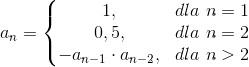
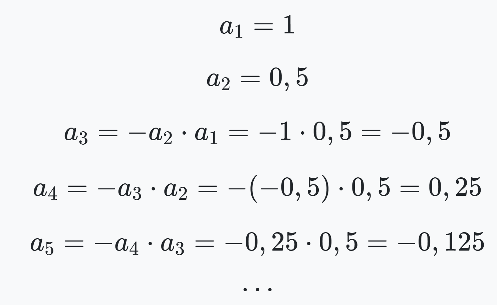

# Programming-course-cpp

`Jakub Piskorowski on 24/10/2023 wersja: 1.0`

## Temat: N-ty wyraz ciągu

Przedstawienie działania algorytmu wyznaczania n-ty wyrazu ciągu.

Kod źródłowy:
[n-wyraz-ciagu.cpp](./n-wyraz-ciagu.cpp)

&#x1F4D7; Poziom 2

Powrót do [Algorytmika](/2-algorytmika/README.md)

---

## Objaśnienie

**Ciąg nieskończony** (lub po prostu **ciąg**) jest to **funkcja**, która odwzorowuje **zbiór liczb naturalnych.**

Nieskończonym ciągiem liczbowym jest na przykład ciąg wszystkich liczb naturalnych nieparzystych, ustalając kolejność od najmniejszej do największej, tj: a1 = 1, a2 = 3, a3 = 5, a4 = 7, ... lub inny zapis (1, 3, 5, 7, 9, ...).

Liczby: **1,4,9,16,25,36,...** to kwadraty kolejnych liczb naturalnych. Mówimy, że takie liczby tworzą ciąg.

Więcej przykładów ciągów liczbowych:
- **1,2,3,4,5,6...** - ciąg kolejnych liczb naturalnych.
- **2,4,6,8,10,12,14,...** - ciąg kolejnych liczb parzystych dodatnich.
- **1,−1,2,−2,3,−3,4,−4,...** - naprzemienny ciąg liczb dodatnich i ujemnych.
- **1,12,14,18,116,132,164...** - malejący ciąg ułamków.
- **3,9,27,81,243,...** - ciąg kolejnych potęg 3.
- **80,77,74,71,68,65,62,59,56,...** - ciąg malejący

W każdym z powyższych przykładów ciąg liczb powstawał zgodnie z pewną ustaloną regułą. 

### N-ty wyraz ciągu

Poniżej zdefiniowany jest pewien ciąg, którego kolejne wyrazy generowane są w sposób rekurencyjny:



Napisz program, który znajdzie wartość n-tego wyrazu ciągu.

Wypiszemy kilka kolejnych wyrazów tego ciągu:



## Funkcja wyznaczania n-tego wyrazu ciągu rekurencyjnie

**Wejście** \
`n` - nr wyrazu ciągu

**Wyjście** \
`n` - wartosc n-tego wyrazu ciagu

**Lista kroków:**\
K1: &emsp; `jeżeli n=1` &emsp; wykonuj krok K2 \
K2: &emsp; `zwróć wartość 1` \
K3: &emsp; `jeżeli n=2` &emsp; wykonuj krok K4 \
K4: &emsp; `zwróć wartość 0.5` \
K5: &emsp; `zwróć -funkcja(n-1) * funkcja(n-2)`

Wynik działania programu:

```text
Podaj nr wyrazu ciagu, ktorego wartosc chcesz policzyc: 8
8 wyraz ciagu ma wartosc 0.00012207
```

Kod źródłowy: [n-wyraz-ciagu.cpp](n-wyraz-ciagu.cpp)

<!--
Źródło: [algorytm.edu.pl](https://www.algorytm.edu.pl/rekurencja-zadania/76-n-ty-wyraz-ciagu-2.html)
-->