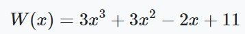
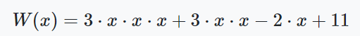
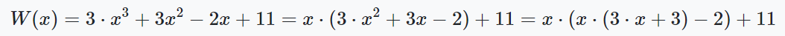
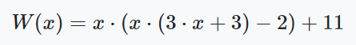

# Programming-course-cpp

`Jakub Piskorowski on 24/10/2023 wersja: 1.0`

## Temat: Schemat Hornera

Przedstawienie działania algorytmu do szybkiego obliczania wartości wielomianu.

Kod źródłowy:
[schemat-hornera.cpp](./schemat-hornera.cpp)

&#x1F4D5; Poziom 3

Powrót do [Algorytmika](/2-algorytmika/README.md)

---

## Objaśnienie

Jednomian jest iloczynem liczb i liter (zmiennych). \
Jednomian stopnia n - to funkcja postaci: y = ax^n

Schemat Hornera jest algorytmem służącym do bardzo szybkiego obliczania wartości wielomianu. Redukuje on ilość mnożeń do minimum. Przeanalizujmy następujący wielomian:



Do wyznaczenia wartości wielomianu tradycyjnym sposobem należy wykonać 6 mnożeń:



Schematem Hornera tych mnożeń należy wykonać tylko 3: 



a więc mamy: 



Danymi wejściowymi będą współczynniki wielomianu oraz jego stopień. Następnie podamy argument, dla jakiego chcemy wyznaczyć wartość wielomianu. Zauważmy, że wielomian, którego stopień jest równy `n` ma `n + 1` czynników.

## Algorytm obliczania wartości wielomianu

K1: &emsp; `*wspolczynnik` &emsp; wskaźnik współczynników \
K2: &emsp; `stopien, argument` &emsp; deklaracja zmiennych stopnia oraz argumentu \
K3: &emsp; `pobranie stopnia wielomianu` &emsp; pobranie od użytkownika wartości \
K4: &emsp; `wspolczynnik ← new int [stopien+1]` &emsp; deklaracja dynamicznej tablicy \
k5: &emsp; `dopóki i < stopien` &emsp; wczytanie współczynników \
&emsp; &emsp; &emsp; `wykonuj krok K6` \
K6: &emsp; `wprowadź wspolczynnik[i]` \
K7: &emsp; `pobranie argumentu` &emsp; pobranie od użytkownika argumentu wielomianu \
K8: &emsp; `wywołaj funkcję` &emsp; wywyłanie funkcji Horner \
K9: &emsp; `usunięcie tablicy wspolczynniki`

### Funkcja schematu hornera rekurencyjnie

**Wejście** \
`wsp[]` - tablica z współczynnikami \
`st` - stopień wielomianu \
`x` - argument

**Lista kroków:**\
K1: &emsp; `jeżeli st=0` &emsp; wykonuj krok K2 \
&emsp; &emsp; &emsp; `zwróć wsp[0]` \
K2: &emsp; `zwróć x * funkcja(wsp, st-1, x) + wsp[st]`

Wynik działania programu:

```text
Podaj stopien wielomianu: 3
Podaj wspolczynnik stojacy przy potedze 3: 3
Podaj wspolczynnik stojacy przy potedze 2: 3
Podaj wspolczynnik stojacy przy potedze 1: -2
Podaj wspolczynnik stojacy przy potedze 0: 11
Podaj argument: 1
W( 1 ) = 15
```

Kod źródłowy: [schemat-hornera.cpp](./schemat-hornera.cpp)

<!--
Źródło: [algorytm.edu.pl](https://www.algorytm.edu.pl/algorytmy-maturalne/schemat-hornera.html)
-->