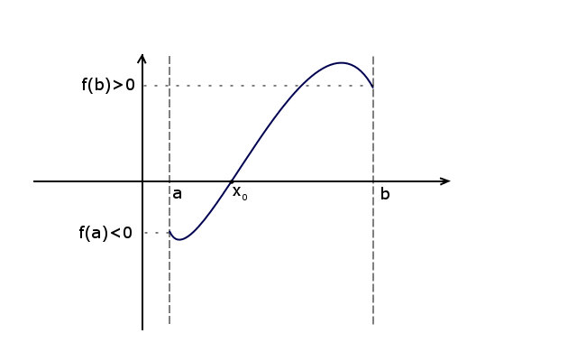
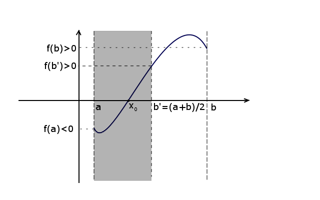
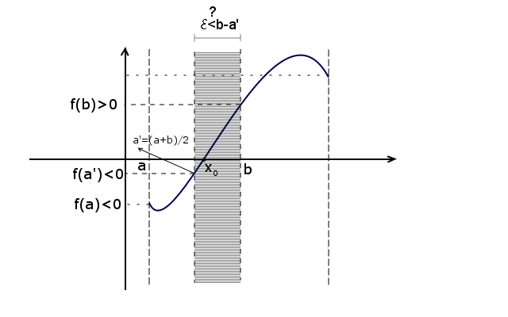

# Programming-course-cpp

`Jakub Piskorowski on 31/10/2023 wersja: 1.0`

## Temat: Znajdowanie miejsca zerowego metodą połowienia przedziałów

Przedstawienie działania algorytmu znajdowanie miejsca zerowego metodą połowienia przedziałów

Kod źródłowy:
[set-precision.cpp](./set-precision.cpp) \
[polowienie-przedzialow-iteracyjnie.cpp](./polowienie-przedzialow-iteracyjnie.cpp) \
[polowienie-przedzialow-rekurencyjnie.cpp](./polowienie-przedzialow-rekurencyjnie.cpp)


&#x1F4D5; Poziom 3

Powrót do [Algorytmika](/2-algorytmika/README.md)

---

## Objaśnienie

Omawiany algorytm wyznacza miejsce zerowe z dokładnością do pewnego **ϵ** (epsilon) (dokładność tą ustalamy na początku programu) w przedziale obustronnie domkniętym [a,b] przy następujących założeniach:
- **Funkcja jest ciągła** (oznacza to, że jej wykres narysujemy nie odrywając ołówka, chodź definicja funkcji ciągłej jest znacznie bardziej złożona)
- W przedziale [a,b] funkcja **ma dokładnie jedno miejsce zerowe.**

Przyjrzyjmy się poniższemu rysunkowi spełniającemu powyższe założenia:



Dla każdej takiej funkcji będzie zachodził warunek:
``` text
f(a) * f(b) < 0
``````

ponieważ wartości na krańcach przedziałów będą zawsze przeciwnych znaków (chyba, że miejsce zerowe znajduje się w jednym z krańców). \
W pierwszym kroku wyznaczamy środek przedziału i sprawdzamy, czy nie jest on już miejscem zerowym. Jeśli nie to sprawdzamy czy:
``` text
f(a) * f(srodek) < 0
``` 
Jeśli tak, to miejsce zerowe musi znajdować się w przedziale: \
`[a, srodek)` \
w przeciwnym razie w przedziale: \
`(srodek, b]` \
W pierwszej sytuacji wartość `b` zostanie zastąpiona wartością `środka`, w drugiej wartość `a`. \
W omawianym przykładzie zachodzi sytuacja pierwsza:



Czynności dzielenia przedziału `[a, b]` powtarzamy do momentu, aż nie będzie spełniony warunek `ϵ < a−b`.



Gdy osiągniemy szukaną dokładność, tzn. `b - a <= ϵ`, możemy wypisać miejsce zerowe, które przyjmuje wartość `(b-a) / 2`. 

Przedstawiony algorytm szuka miejsca zerowego dla wielomianu:
``` text
f(x) = x^3 - 3x^2 + 2x - 6
```

który spełnia podane na początku artykułu założenia. Program wyznacza miejsce zerowe z dokładnością do pięciu miejsc po przecinku.

### Ustawienie dokładności
``` cpp
#include <iostream>     // fixed
#include <iomanip>      // setprecision
using namespace std;

int main(){
	double f =3.14159;

	cout << setprecision(5) << f << '\n';
	cout << setprecision(9) << f << '\n';
	cout << fixed;
	cout << setprecision(5) << f << '\n';
	cout << setprecision(9) << f << '\n';

	system("pause");
	return 0;
}
```
Kod źródłowy: [set-precision.cpp](./set-precision.cpp)

Wynik działania programu: 
``` text
3.1416
3.14159
3.14159
3.141590000
```

---

## Algorytm znajdowanie miejsca zerowego

### Funkcja f
Rozpatrujemy wielomian f(x) = x^3 - 3x^2 + 2x - 6  \
Rozbijamy go schematem Hornera i obliczamy jego wartość \
**Wejście:**\
`x` - argument funkcji

**Lista kroków:**\
K1: &emsp; `zwróć x*(x*(x-3)+2)-6;` &emsp;

### Funkcja połowienia przedziałów rozwiązanie iteracyjne

**Wejście:**\
`a = -10` – lewy kraniec przedziału \
`b = 10` - prawy kraniec przedziału \
`epsilon = 0.00001` - dokładność wyznaczania miejsca zerowego  

**Zmienne pomocnicze:** \
`srodek` - wyznaczenie srodka, przedziału

**Lista kroków:**\
K1: &emsp; `jeżeli f(a) = 0.0` \
&emsp; &emsp; &emsp; `zwróć a` \
K2: &emsp; `jeżeli f(b) = 0.0` \
&emsp; &emsp; &emsp; `zwróć b` \
K3: &emsp; `dopóki b-a > epsilon` \
&emsp; &emsp; &emsp; `wykonuj kroki K4...k6` \
K4: &emsp; `srodek ← (a+b)/2` \
K5: &emsp; `jeżeli f(srodek) = 0` &emsp; jeżeli miejsce zerowe jest w środku \
&emsp; &emsp; &emsp; `zwróć środek` \
K6: &emsp; `jeżeli f(a)*f(srodek) < 0` \
&emsp; &emsp; &emsp; `b ← środek` \
&emsp; &emsp; &emsp; `w przeciwnym razie a ← srodek` \
K7: &emsp; `zwróć (a+b)/2`

Wynik działania programu:

```text
Znalezione miejsce zerowe wynosi: 3.00000
```

Kod źródłowy: [polowienie-przedzialow-iteracyjnie.cpp](./polowienie-przedzialow-iteracyjnie.cpp)

---
### Funkcja połowienia przedziałów rozwiązanie rekurencyjne

**Wejście:**\
`a = -10` – lewy kraniec przedziału \
`b = 10` - prawy kraniec przedziału \
`epsilon = 0.00001` - dokładność wyznaczania miejsca zerowego  

**Zmienne pomocnicze:** \
`srodek` - wyznaczenie srodka, przedziału

**Lista kroków:**\
K1: &emsp;`jeżeli f(a) = 0.0` \
&emsp; &emsp; &emsp; `zwróć a` \
K2: &emsp; `jeżeli f(b) = 0.0` \
&emsp; &emsp; &emsp; `zwróć b` \
K3: &emsp; `srodek ← (a+b)/2` \
K4: &emsp; `jeżeli b-a <= epsilon` \
&emsp; &emsp; &emsp; `zwróć środek` \
K5: &emsp; `jeżeli f(a)*f(srodek) < 0` \
&emsp; &emsp; &emsp; `zwroc PolowieniePrzedzialow(a, srodek, epsilon)` \
K6: &emsp; `zwróć PolowieniePrzedzialow(srodek, b, epsilon)`

Kod źródłowy: [polowienie-przedzialow-rekurencyjnie.cpp](./polowienie-przedzialow-rekurencyjnie.cpp)

<!--
Źródło: [algorytm.edu.pl](https://www.algorytm.edu.pl/algorytmy-maturalne/metoda-polowienia-przedzialow.html)
-->